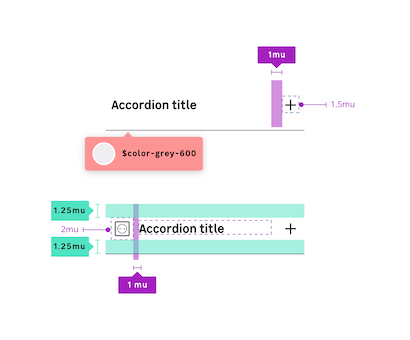
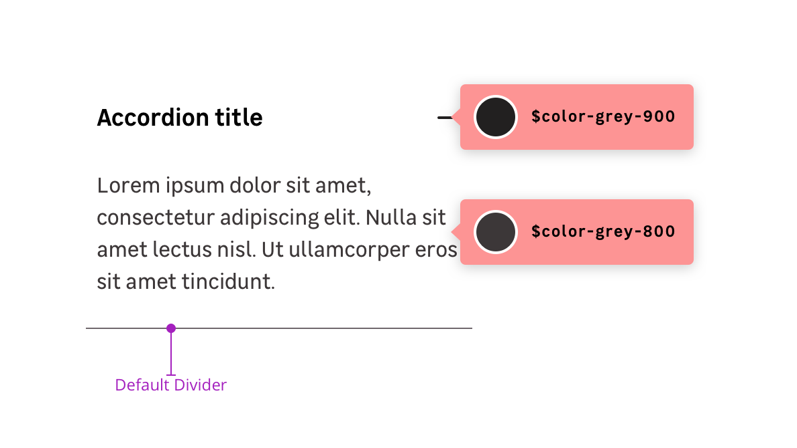
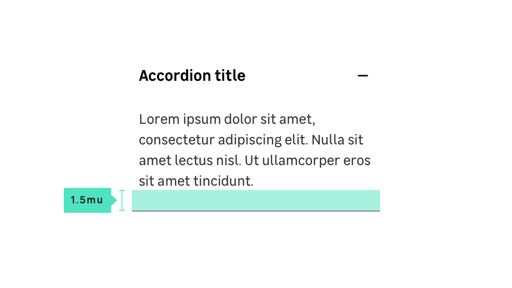

## Anatomy

## Properties

### CSS Tokens : layout

| State       | Property      | Token                |
| ----------- | ------------- | -------------------- |
| **Default** | padding (top) | `mu-125` (1.25rem)      |
| **Default** | padding-left  | `mu-050` (0.5rem)     |
| **Default** | margin (icon) | `mu-100` (1rem)     |
| **Default** | font-size     | `size.font.06`(16px) |

### CSS Tokens : color

| State        | Element                  | Token                |
| ------------ | ------------------------ | -------------------- |
| **Default**  | color (Title)            | `$color-grey-900`    |
| **Default**  | color (Content)          | `$color-grey-800`    |
| **Disabled** | color (Title)            | `$color-grey-600`    |
| **Disabled** | color (Content)          | `$color-grey-600`    |
| **Disabled** | background-color (Title) | `$color-grey-100`    |

### CSS Tokens : content

| State       | Property      | Token                |
| ----------- | ------------- | -------------------- |
| **Default** | padding-bottom| `mu-150` (1.5rem)    |