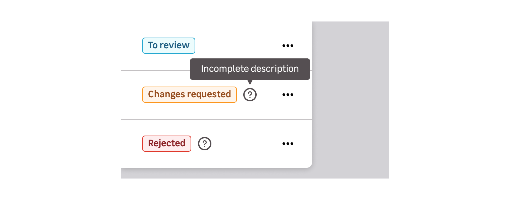
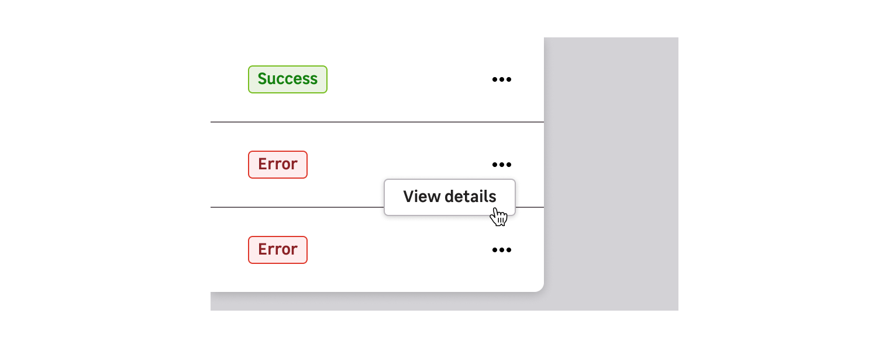

> A badge indicates the status of an entity and can evolve at any time.

## Types

The badge component is available in 5 states. Each state corresponds with a defined status.

| Colour theme    | Status                                                                          | Preview |
| --------------- | ------------------------------------------------------------------------------- | ------- |
| **Information** | New, To review, Draft                                                           |         |
| **Success**     | Validated, Online status                                                        |         |
| **Warning**     | Non-critical error, Incomplete task, Required action                            |         |
| **Danger**      | Critical error, Invalid data, Offline status, Rejected task, Recently cancelled |         |
| **Neutral**     | Archived, Disabled, Draft, Long ago cancelled                                   |         |

<Highlight type="tips" title="Good to know">

Depending on the context, Draft status can use the `Information` or `neutral` colour theme.

</Highlight>

## Behaviours

### Content

States should be easy to read and defined by a generic word. If you have to give more information, don't hesitate to accompany badges with icon tooltip or trigger a modal with components like a button, link, icon, etc.

## Do's and Don'ts

<HintItem>Always use a short label inside the badge.</HintItem>

<HintItem>
  Always use a label in adequation with the state to help the user understand
  the different types of status.
</HintItem>

<HintItem dont>
  Never use a badge as a category, it must only be used to display status.
</HintItem>

<HintItem dont>
  Don't override the colours. They are defined by their status.
</HintItem>

<HintItem dont>
  Don't use several badges for the same element. It can only have one status.
</HintItem>

<HintItem dont>
  Never use a badge as a clickable element. A badge should be used to display
  status information.
</HintItem>
