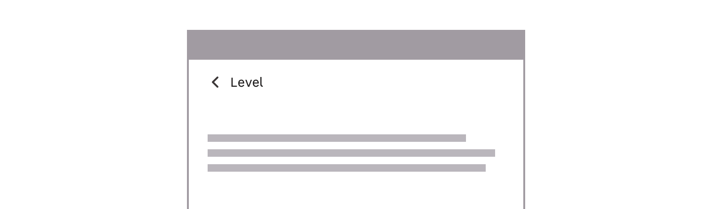

> Breadcrumb is a secondary navigation allowing the user to understand where the current page is located in the website architecture and to go back to previous steps or levels when needed.

# Variations

## Color themes

Every breadcrumb size variation is available both in light and dark version. This allows you to adapt the breadcrumb to the background of your designs.

### Light mode

<Preview path="default" nude />

### Dark mode

<Preview path="dark-mode" nude />

## Breakpoint behaviours

### Smaller breakpoints

Breadcrumb can't be fully displayed on smaller breakpoints, that is why this version allows you to go back on the previous level only.

### Medium and larger breakpoints

For medium and larger breakpoints, you can display the whole path of the current page. We used some links to inform the user that the breadcrumb is clickable.

<Preview path="default" nude />

## Do's and Don'ts

<HintItem>
  Always place the breadcrumb at the top of the page under the header.
</HintItem>
<HintItem>Use breadcrumb for three or more architecture levels.</HintItem>
<HintItem dont>
  Don't use breadcrumb on a website that has two architecture levels only.
</HintItem>
