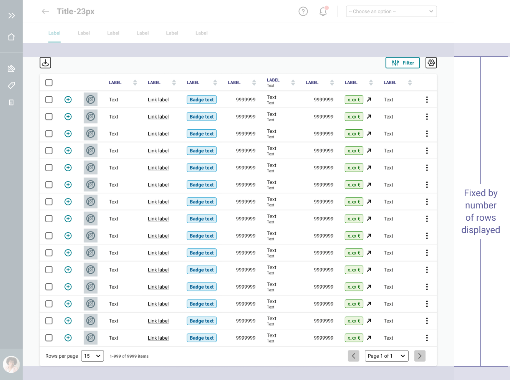

> The DataTable efficiently presents large sets of organised data in rows and columns. Its structured format allows for intuitive browsing and analysis of complex information. With built-in paging, sorting, and filtering features, the DataTable is a powerful tool.

<Story id="datatable-datatable--default" height="670" />

## Structure

### Top bar

The top bar section allows users to edit, filter, set up or do actions.  
Each element of the top bar is optional, as is the top bar itself.

<Story id="datatable-datatable--header-only" />

#### Edition

Allow users to interact with selected items.

| Feature                     | Usage                                | Note                                                                                                  |
| --------------------------- | ------------------------------------ | ----------------------------------------------------------------------------------------------------- |
| **Edit selection**          | Allow to edit data on selected items | Only available when rows are selected                                                                 |
| **Download**                | Download table or selected rows      |                                                                                                       |
| **Number of selected rows** | Display the number of selected rows  | Please, read the [related documentation](/Components/DataTable/#mass-selection/) for more information |

<Highlight type="warning" title="Be careful">
  Styles, labels and icons are not customisable to maintain consistency.
</Highlight>

#### Filter

| Feature           | Usage                                                     | Preview |
| ----------------- | --------------------------------------------------------- | ------- |
| **Toggle**        | Quick filter (max. 1)                                     |         |
| **Search input**  | Filter rows with keywords (Please, be explicit for users) |         |
| **Filter button** | Open filters layer                                        |         |

#### Active filter

Active filters are displayed between the top bar and the data content to allow users to remove them easier from [Removable tags](/Components/Tag/#removable-tags), along with a reset button to remove them all at once. Please allow for an empty state in case no results match the filters.

{/* <!-- Add preview --> */}

An empty state must be defined if there are no results.

#### Settings

Allow users to set up the display of the datatable layout.

| Feature      | Usage                                                                                                        | Preview |
| ------------ | ------------------------------------------------------------------------------------------------------------ | ------- |
| **Settings** | Access to table edition like edit columns (reorder, show/hide) or change display density (size of the cells) |         |

#### Actions

Actions relate to the data in the table to validate an item or adding a line.

| Feature                      | Type                               |
| ---------------------------- | ---------------------------------- |
| **Validation action**        | Primary button (solid variation)   |
| **Rejected/Negative action** | Danger button (bordered variation) |

<Highlight type="tips" title="Good to know">

Action buttons can be customised, ensuring compliance with good UX practices and the usages defined in the design system.
Using a bottom is recommended for more global actions related to a process or a business gesture.

</Highlight>

### Data content

#### Columns

The Datatable allows displaying of several types of data.
Only one type of data must be displayed per column to ensure the optimal readability of all the data.

| Data                                  | Usage                                                                                                                         | Width behaviour        |
| ------------------------------------- | ----------------------------------------------------------------------------------------------------------------------------- | ---------------------- |
| **Text**                              | Display the name, short description of an item                                                                                | Fixed or fluid         |
| **Multi-line text**                   | Use to be more explicit and display complementary information of an item                                                      | Fixed or fluid         |
| **Number**                            | Display numeric value. The content is always right justified for better reading                                               | Fixed or fluid         |
| [**Badge**](/Components/Badge/)       | Display the item status                                                                                                       | Adapted to the content |
| **Input**                             | Allow to edit the content of an item                                                                                          | Fixed or fluid         |
| [**Checkbox**](/Components/Checkbox/) | Allow to select an item. Only one column per table, always in first position (on the left)                                    | Fixed                  |
| **Options**                           | Display multiple actions. Only one column per table, always in last position (on the right)                                   | Fixed                  |
| **Icon**                              | Display one specific action                                                                                                   | Fixed                  |
| [**Link**](/Components/Link/)         | Allow to access to the dedicated page of an item                                                                              | Fixed or fluid         |
| **KPI**                               | Display a progression indicator                                                                                               | Adapted to the content |
| **Expand**                            | Display sub-items or details about an item (Only one column per table, always in first position or after the checkbox column) | Fixed                  |

#### Rows

In a table, rows correspond to items, while columns list data types for each object, such as status, description, or numeric values. Selecting a row with a checkbox changes its background colour for improved readability.

{/* <!-- Add preview --> */}

#### Sub-rows

Sub-rows provide more details of an item and can't be selected or modified as an object.

#### Column header

The column header includes:

- A global checkbox for selecting all rows of the current page,
- Capitalized column labels to differentiate them from the data,
- A sorting feature for user assistance.

<Highlight type="tips" title="Good to know">

Depending on the context, the column header can be fixed as well.

</Highlight>

#### Mass selection

Once users have selected all the rows on a page, a dedicated banner for mass selection will appear, allowing them to select all rows in the table, including all pages.

#### Empty state

An empty state should be defined when no results are found, with a user-friendly message that can be customized to the context, ensuring clarity and avoiding technical language.

### Footer

As the number of rows is variable, the DataTable footer is a mandatory element that allows users to manage the navigation and pagination of the table.

<Story id="datatable-datatable--footer-only" />

| Feature                                   | Usage                                                                                   | Preview |
| ----------------------------------------- | --------------------------------------------------------------------------------------- | ------- |
| **Row number selector**                   | Allow users to choose the number of row to display                                      |         |
| **Rows indicator**                        | Indicate the number of rows displayed on the page compared to the total number of rows. |         |
| [**Pagination**](/Components/Pagination/) | Allow users to navigate to the other pages of the datatable                             |         |

## Variations

### Sizes

Cells are available in 3 sizes.

| Size             | Value        |
| ---------------- | ------------ |
| Small            | 2.5mu (40px) |
| Medium (default) | 3mu (48px)   |
| Large            | 3.5mu (56px) |

## Layout

The data table's height can be defined in two ways to prevent scroll overlap: using the viewport size or specifying the number of displayed rows.

##### By the size of the viewport

##### By the number of rows displayed

<Highlight type="warning" title="Be aware">
  For the moment, the Datatable component is only available for desktop use.
</Highlight>

## How to use

<Highlight type="warning" title="Work in progress">
  We are currently working on the how to use documentation, it will be available
  soon.
</Highlight>

## Do's and Dont's

<HintItem>
  Use capital letters only for the Column header labels, not for data.
</HintItem>

<HintItem dont>
  Never combine different sizes of cells inside the same datatable.
</HintItem>

<HintItem dont>Never use more than one quick filter.</HintItem>
