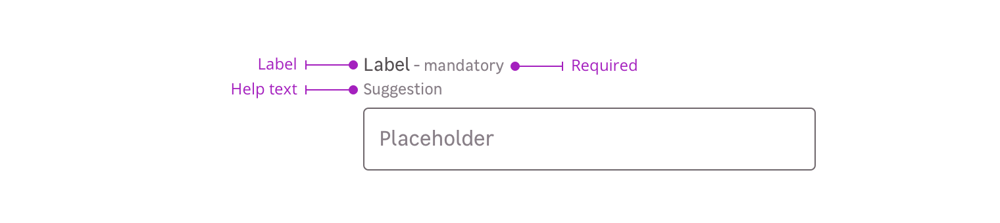

> Fields enable the user to input content in a form. It displays an input, a label, useful informations as well as validation feedback.

## Anatomy

### Label

The label helps the user to understand what information is needed.

### Required

This mention allows to specify that this information is mandatory for the field to be valid.

### Help text 

Help text corresponds to a relevant piece of information to make sure the user understands what is needed.

## Do's and don'ts

<HintItem>
  It is recommended to use short and accurate labels.
</HintItem>

<HintItem>
  Use Input text for monoline text. For multiple lines, use a textarea instead.
</HintItem>

<HintItem>
  Always use a label associated with an input, even using placeholders
</HintItem>

<HintItem dont>
  Use the same value for labels and placeholders.
</HintItem>

<HintItem dont>
  Never use different text input sizes together.
</HintItem>

<HintItem dont>
  Never use a medium input with a small button.
</HintItem>
