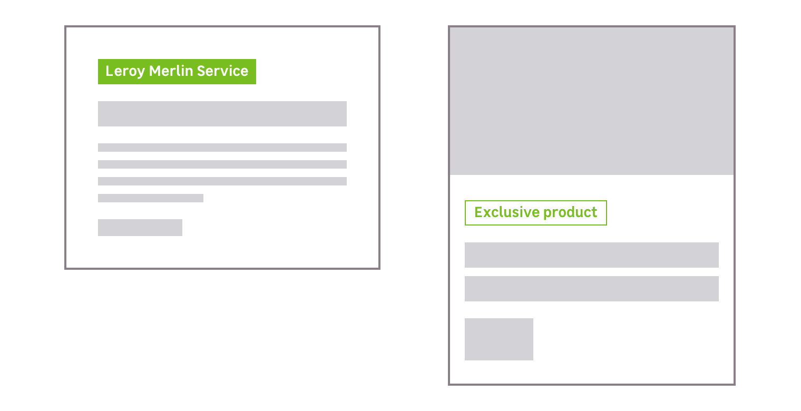
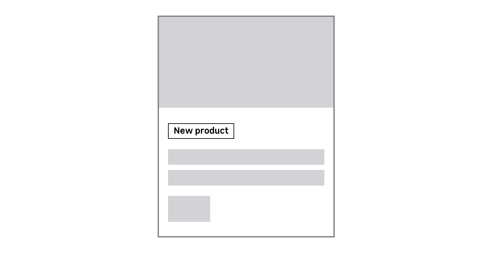

> A flag is used to display meta-informations about a product or a service. It must be displayed at the top of the content, and used as an indicator of a content main category.

Please use a [tag](/components/tag/) if you need to display additional information.

<Story id="data-flag--all-variations" height="400" />

## Variations

There is different usages, depending on a color scheme.

### Primary

For display meta-informations on Leroy Merlin related content. It's used to indicate which products or services are exclusive to Leroy Merlin.

### Light & Dark

Used to indicate when a product is new.

### Danger

Used for sales content, to display meta-informations about a discount on a article or a product page.

### Two styles to make what's important stand out

The styles are useful to create hierarchy, depending on your need and the constrast of the background.

- Solid
- Bordered

## Do's and Don'ts

<HintItem>Use a flag to categorize a card or a content.</HintItem>
<HintItem dont>Never use it inside a paragraph.</HintItem>
<HintItem dont>Never use a sentence or many words inside a flag.</HintItem>
<HintItem dont>
  Never use a flag as a clickable element, to trigger an action or as a link.
</HintItem>
<HintItem dont>
  Never stretch a flag. Flag is never fluid, its width is depending on its
  content.
</HintItem>
