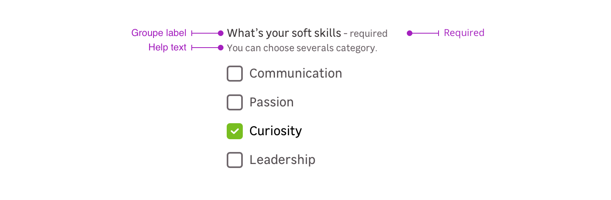

> Checkboxes are used to **select one or multiple options in a list**. They usually find their place in forms and are also used to accept some mentions.

<Story id="form-checkbox--default" />

## States

### Default states

The checkbox has two default states, checked and unchecked. Every state has a disabled and an invalid variation.

### Indeterminate

This case is used when several items of a sublist are selected. In this specific case, the parent checkbox will have the indeterminate case displayed. Note that you can select or unselect every item of the sublist with this parent checkbox.

<Story id="form-checkbox-group--indeterminate" />

> The above preview is given as an example, you cannot interact with it.

## Checkbox item

The checkbox item is a combinaison of an input and a label.

<Highlight type="warning">

A checkbox can't be used without an associated label.

</Highlight>

## Checkbox group

The checkbox group is a combination of the following mentions. Please note that you can use four different cases:

- Group label + checkbox-es
- Group label + requirement + checkbox-es
- Group label + requirement + help text + checkbox-es
- Groupe label + help text + checkbox-es

### Group label

The label group helps the user to understand which box-es to check.

<Story id="form-checkbox-group--default" />

### Requirement

This mention allows to specify that this information is mandatory for the input to be valid.

<Highlight type="tips">

Please note that this mention can also be used to say a specific input is **optional** when the other ones are mandatory.

</Highlight>

### Help text

Help text corresponds to a relevant piece of information to make sure that the user understands what is needed.

> Note that the elements become horizontally aligned from the `m-medium` breakpoint _(768px)_. Below this resolution, the elements are arranged vertically.

## Validation

There are two different elements for validation feedback:

- The color of the input outline.
- A text under the checkbox group explains what's wrong with the data entered.

<Story id="form-checkbox-group--state-invalid" />

## Do's and Don'ts

<HintItem>Always use the checkbox with a label.</HintItem>
<HintItem dont>
  Never use a checkbox to select one option from a list. Use a Radio instead.
</HintItem>
