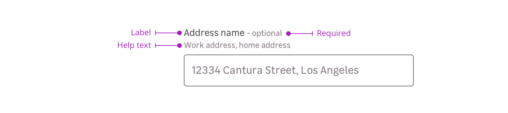

> Fields enable the user to input content in a form. It displays a label, useful informations, an input and gives validation feedback.

<Story id="form-field--full-example" />

## Overview

Fields are a combination of the following mentions. Please note that you can use four different cases:

- Label only + input
- Label + requirement + input
- Label + requirement + help text + input
- Label + help text + input

### Label

The label helps the user to understand what information is needed in the field.

<Story id="form-field--default" />

### Requirement

This mention allows to specify that this information is mandatory for the field to be valid.

<Highlight type="tips">

Please note that this mention can also be used to say a specific field is **optional** when the other ones are mandatory.

</Highlight>

<Story id="form-field--with-requirement-text" />

### Help text

Help text corresponds to a relevant piece of information to make sure the user understands what is needed.

<Story id="form-field--with-help-text" />

## Validation

There are two different elements for validation feedback:

- An icon placed in the input.
- A text under the field explains what's wrong with the data entered.

<Story id="form-field--with-help-text" />

## Sizes

You can use two different sizes for fields to answer different needs. You can use both cases to suit your interface the best. Just keep in mind touch devices when placing smaller elements near each other.

<Highlight type="warning">

Never use different field sizes together.

</Highlight>

## Do's and Don'ts

<HintItem>It is recommended to use short and accurate labels.</HintItem>

<HintItem dont>Use the same value for labels and placeholders.</HintItem>
