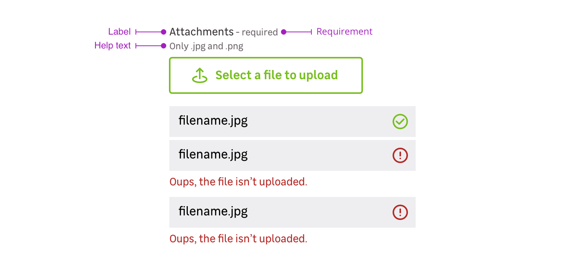

> A file uploader is a pattern mainly used in forms. It allows the user to upload one or several files like pictures or documents.

## Overview

A file uploader is a combination of the following mentions. Please note that you can use five different cases:

- Label only + file uploader
- Label + requirement + file uploader
- Label + requirement + help text + file uploader
- Label + help text + file uploader
- File uploader only

### Label

The label helps the user to understand what information is needed in the file uploader.

<Preview path="with-field" nude />

### Requirement

This mention allows to specify that this information is mandatory for the file uploader to be valid.

<Preview path="requirement" nude />

### Help text

Help text corresponds to a relevant piece of information to make sure the user understands what is needed.

<Preview path="help-text" nude />

### File uploader only

In specific use cases, you can use a file uploader without label.

<Preview path="default" nude />

## Behaviors

### Initial state

A File uploader is triggered by a medium bordered primary button.

<Preview path="default" nude />

### Files preview

> To go further, you can customize the files preview.

After uploading a file, a tile is added at to the bottom of the component. This tile allows the user to see the file name and its status :

- Uploaded
- Error

<Preview path="uploaded-files-with-errors" nude />

### Two ways to upload

#### Single upload

When the file uploader allows the user to upload only one file it automatically overwrites the previously uploaded file when a new file is uploaded.

<Preview path="with-attribute-accept" nude />

#### Multiple upload

When the file uploader allows the user to upload multiple files, the user can select several files in the dedicated browser window. The files will be added with the previously uploaded files if you repeat this action.

<Preview path="with-attribute-multiple" nude />

## Do's and Dont's

<HintItem>
  Always give feedback to the user when a file is uploaded or not.
</HintItem>
<HintItem dont>
  Never use a solid primary button to trigger the upload.
</HintItem>
