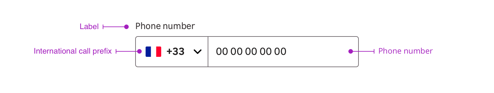

> Phone number input enables the user to input its phone number with an international country prefix in a form element.

<Story id="form-phone-number-input--default" />

## Overview

Phone number input is a combination of the following mentions:

- Label (optional)
- Dropdown with a flag and an international country prefix
- Phone number field

## Behaviour

By clicking on the dropdown, users will display a list from which they will choose their country and the dedicated prefix.

<Story id="form-phone-number-input--opened" height="320" />
