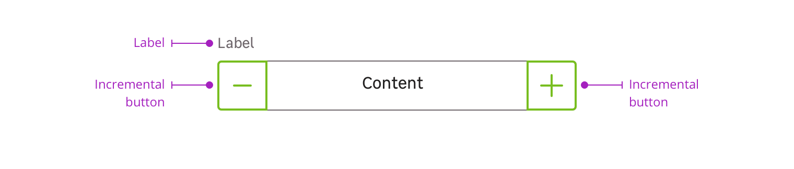

> The quantity selector is a form element used to enter or select a number. This type of input is best used when the user needs to choose the quantity of a selected item, like a product before adding to cart for example.

<Story id="form-quantity-selector--default" />

<Highlight type="tips">

Don't forget that the user can use its keyboard or the incremental buttons to select the quantity.

</Highlight>

## Overview

Quantity Selector is a combination of the following mentions:

- Label (optional)
- Incremental buttons + quantity field

## Sizes

We provide two different sizes to adapt to your design needs but keep in mind that the `medium` case must be used on smaller breakpoints. More on [accessibility](/components/form/quantity-selector/accessibility/) page.

<Story id="form-quantity-selector--small-size" />

## Behaviors

You can also require a minimal value from the user. In this case the minus button must be disabled.

<Story id="form-quantity-selector--minimal" />

## Do's and Don'ts

<HintItem dont>
  Never use quantity selector when the user needs to choose a date.
</HintItem>
