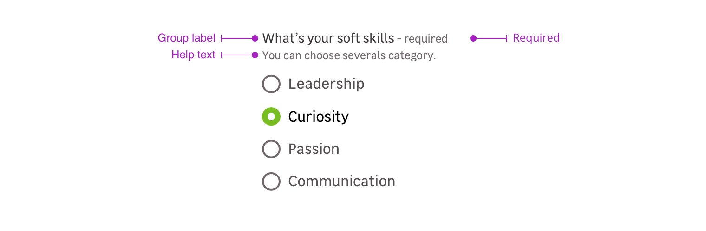

> A radio button is used to offer a unique choice to your user in a form. Unlike checkboxes, it can not be used alone.

<Story id="form-radio--default" />

## Overview

<Highlight type="warning">

A radio button can't be used alone, it must be used within a group.

</Highlight>

Radio button group is a combination of the following mentions. Please note that you can use four different cases:

- Group label + radio buttons
- Group label + requirement + radio buttons
- Group label + requirement + help text + radio buttons
- Groupe label + help text + radio buttons

### Label group

The label group helps the user to understand which radio to check.

<Story id="form-radio-group--default" />

### Requirement

This mention allows to specify that this information is mandatory for the input to be valid.

<Highlight type="tips">

Please note that this mention can also be used to say a specific input is **optional** when the other ones are mandatory.

</Highlight>

### Help text

Help text corresponds to a relevant piece of information to make sure the user understands what is needed.

> Note that the elements become horizontally aligned from the `m-medium` breakpoint _(768px)_. Below this resolution, the elements are arranged vertically.

## Validation

There are two different elements for validation feedback:

- The color of the input outline.
- A text under the radio button group explains what's wrong with the data entered.

<Story id="form-radio-group--state-invalid" />

## Do's and Don'ts

<HintItem>A radio buttons list must include a minimum of two options.</HintItem>

<HintItem>
  Use short radio list. User should be able to scan quickly between few option.
  If you have a lot of option, prefer a drop down list.
</HintItem>

<HintItem>Preselect an option for the user whenever possible.</HintItem>

<HintItem dont>
  Never use the radio alone. You should always use it with a label and within a
  group.
</HintItem>
