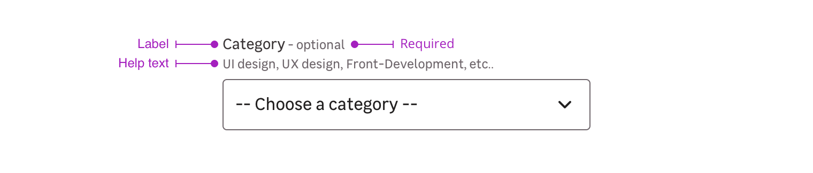

> A select is a selection tool used in forms, allowing user to choose between multiple predefined options.

<Story id="form-select--default" />

## Overview

Selects are a combination of the following mentions. Please note that you can use four different cases:

- Label only + input
- Label + requirement + input
- Label + requirement + help text + input
- Label + help text + input
- Input only

### Label

The label helps the user to understand what information is needed in the select.

<Story id="form-select--default" />

### Requirement

This mention allows to specify that this information is mandatory for the select to be valid.

<Highlight type="tips">

Please note that this mention can also be used to say a specific select is **optional** when the other ones are mandatory.

</Highlight>

### Help text

Help text corresponds to a relevant piece of information to make sure the user understands what is needed.

### Input only

In specific use cases, you can use a select without label. For example to sort items in page list or search engine result page.

<Story id="form-select--single" />

## Validation

There are two different elements for validation feedback:

- The color of the input outline.
- A text under the input explains what's wrong with the data entered.

### State Valid

<Story id="form-select--state-valid" />

### State Invalid

<Story id="form-select--state-invalid" />

## Sizes

You can use two different sizes to answer different needs. You can use both cases to suit your interface the best. Just keep in mind touch devices when placing smaller elements near each other.

<Highlight type="warning">

Never use different select sizes together.

</Highlight>

### Size small

<Story id="form-select--variation-small" />

### Size default

<Story id="form-select--default" />

## Do's and Don'ts

<HintItem>Always use a select with a meaningful label.</HintItem>

<HintItem>
  Always use a select maximum width in relation to the options line length.
</HintItem>

<HintItem>It's recommended to use shorts option texts.</HintItem>

<HintItem>Always Capitalise the first letter of a select option.</HintItem>

<Hint
  type="do"
  title="Always use '--' before and after the first option used as a placeholder with spaces between the dashes and the text."
>
  <Story id="form-select--default" />
</Hint>

<HintItem dont>
  Don't use select with very short list of options, if you have less than 7
  options, use radio buttons instead.
</HintItem>

<HintItem dont>
  Don't use select if you have more than 15 values. It's recommended to use an
  autocomplete search field inside a dropdown instead.
</HintItem>

<HintItem dont>
  Never use preselected option, it can create an incorrect user data. Please use
  a button group for the popular values, along with a select for the others.
</HintItem>

## Good to know

<Highlight type="tips">

Learn more about the good practices of selects on [this article](https://uxplanet.org/ux-design-drop-downs-in-forms-c6943ec30037).

</Highlight>
