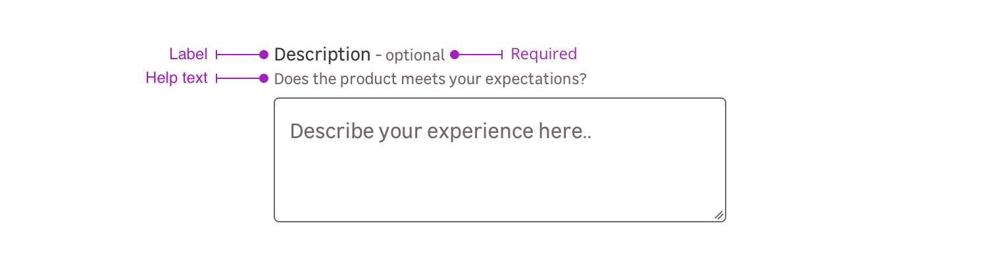

> A text area is used to fill multi-line text. They share appearence and states with [text inputs](/Components/TextInput/).

<Preview path="textarea-full" nude />

Text areas are used for content **with multiple sentence like**:

- Description
- Review message
- Feedback
- ...

## Overview

Text areas are a combination of the following mentions. Please note that you can use four different cases:
  - Label only + input
  - Label + requirement + input
  - Label + requirement + help text + input
  - Label + help text + input
  - Input only

### Label

The label helps the user to understand what information is needed in the text area.

<Preview path="default" nude />

### Requirement

This mention allows to specify that this information is mandatory for the text area to be valid.

<Highlight theme="tips">

  Please note that this mention can also be used to say a specific text area is **optional** when the other ones are mandatory.

</Highlight>

<Preview path="requirement" nude />

### Help text

Help text corresponds to a relevant piece of information to make sure the user understands what is needed.

<Preview path="help-text" nude />

### Input only

In specific use cases, you can use a text area without label.

<Preview path="single" nude />

## Do's & Don'ts

<HintItem>Always use a textarea to fill multi-line texts.</HintItem>
<HintItem>
  Allow users to resize the field height to see more or less the content.
</HintItem>
<HintItem>A textarea height should allow at least 3 lines of text.</HintItem>
<HintItem>
  Adapt the textarea width and height depending on the requested content type
  and length.
</HintItem>
