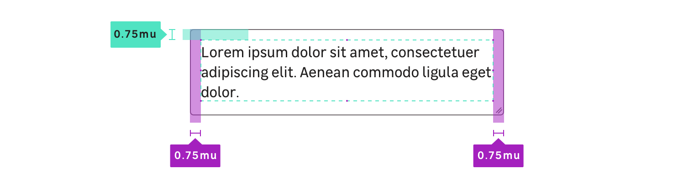

## Anatomy

## Properties

### CSS Tokens : layout

| State   | Property      | Token            |
| ------- | ------------- | ---------------- |
| **all** | border-radius | `radius.m` (4px) |
| **all** | border-width  | `border.s` (1px) |
| **all** | padding       | `1mu` (16px)     |
| **all** | padding       | `1mu` (16px)     |

### CSS Tokens : state colors

**You must always use the tokens, the colors are listed here for information purposes only.**

| State        | Property          | Token                             | Color   |
| ------------ | ----------------- | --------------------------------- | ------- |
| **Default**  | background        | `color.input.background`          | #ffffff |
| **Default**  | border-color      | `color.input.border`              | #6f676c |
| **Default**  | color             | `color.input.text`                | #222020 |
| **Default**  | placeholder color | `color.input.placeholder`         | #222020 |
| **Hover**    | border-color      | `color.input.hover.border`        | #222020 |
| **Focus**    | border-color      | `color.input.focus.border`        | #25a8d0 |
| **Disabled** | background        | `color.input.disabled.background` | #eeeef0 |
| **Disabled** | border-color      | `color.input.disabled.border`     | #a19ba2 |
