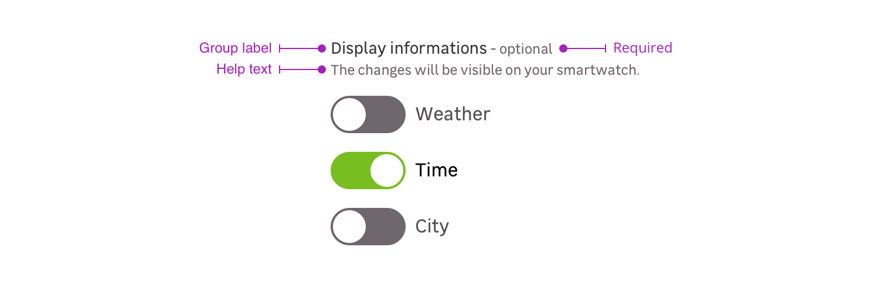
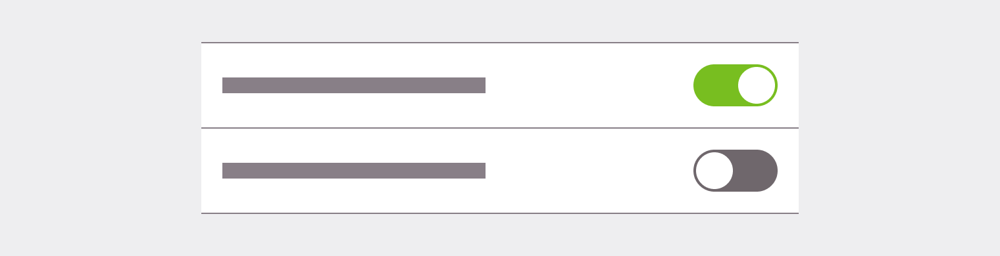

> A toggle is used to choose between two possibilities and when the user needs instant feedback. It is common to use toggles when you need to show or hide content and "on/off" switch.

## Toggle item

The toggle item is a combinaison of an input and a label.

<Story id="form-toggle--default" />

## Toggle group

Toggle group is a combination of the following mentions. Please note that you can use five different cases:

- Group label + toggle-s
- Group label + requirement + toggle-s
- Group label + requirement + help text + toggle-s
- Groupe label + help text + toggle-s

### Group label

The label group helps the user to understand which toggle to select.

<Story id="form-toggle--group" />

### Requirement

This mention allows to specify that this information is mandatory for the input to be valid.

<Highlight type="tips">

Please note that this mention can also be used to say a specific input is **optional** when the other ones are mandatory.

</Highlight>

<Story id="form-toggle--group-requirement-light" />

### Help text

Help text corresponds to a relevant piece of information to make sure the user understands what is needed.

<Story id="form-toggle--group-help-text-light" />

## Sizes

- `S` or small : Used only on desktop when space is a concern.

<Story id="form-toggle--small" />

- `M` or medium (default): Should be the exclusive size for touch devices, and be used in most of the cases on desktop.

<Story id="form-toggle--default" />

## States

<Story id="form-toggle--states" height="280" />

### Displaying On/Off states in label

You can use a reactive label, witch will change depending on the state of the toggle.

<Story id="form-toggle--state-label-variation" />

### Label on two lines

In uncommon use cases where the text is on two lines, the text box must stay centred with the toggle.

<Highlight type="warning" title="Be aware">
  As a reminder, a toggle is used to have instant feedback, using a short label
  is the best way to use this component.
</Highlight>

<Story id="form-toggle--long-label-variation" />

# Specific case

In specific cases, you can use the toggle without its default label.

However, make sure that its use must be relevant and understood by users.

## Do's and Don'ts

<HintItem>Always use M sized toggle on touch devices.</HintItem>
<HintItem>
  Toggle should always trigger instantaneous action and feedbacks.
   
  User should never be asked for another validation action.
</HintItem>
<HintItem>
  Use checkboxes instead of toggles if another validation action is to be
  required from the user.
</HintItem>
<HintItem dont>
  Never use toggle for multiple choices in a set of related options, use
  checkboxes instead.
</HintItem>
<HintItem dont>Never use toggle when validation action is required.</HintItem>

<Highlight type="tips" title="Good to know">

You can find more informations in [this medium article](https://uxplanet.org/checkbox-vs-toggle-switch-7fc6e83f10b8).

</Highlight>
