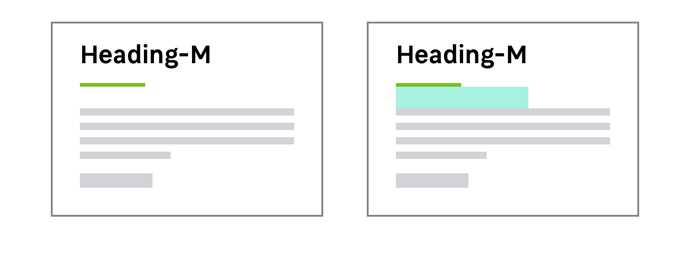

> The heading provides basic typographic styles for your page titles, also known as H1. Each heading has its own sizes depending on the breakpoints.

<Highlight type="tips" title="Heading styles">

By default the heading is underlined. Depending on the context you can remove the underline to make the heading less attractive.  
[Read more about the underline](/Components/Heading/#underline-colours).

</Highlight>

<Story id="content-heading--default" />

## Default size

### Medium Heading

Medium heading is supposed to be used as the default heading style. Every breakpoint has a default value that should be used in most cases.

|  Breakpoint                 |  Heading size   |
| --------------------------- | --------------- |
| `S` (320px and up)          | 28px (1.75mu)   |
| `M` (680px and up)          | 34px (2.125mu)  |
| `L` to `XL` (1024px and up) | 41px (2.5625mu) |

<Story id="content-heading--default" />

## Specific sizes

The heading component system still allows you to answer specific needs depending on the content of your pages or your section.

<Story id="content-heading--sizes" height="320" />

### Small Heading

These heading sizes are the smallest sizes you can use for your titles.

<Highlight type="warning" title="Be aware">
  If you use smaller values you will loose visual hierarchy with the body.
</Highlight>

|  Breakpoint                 |  Heading size  |
| --------------------------- | -------------- |
| `S` (320px and up)          | 23px (1.75mu)  |
| `M` (680px and up)          | 28px (1.75mu)  |
| `L` to `XL` (1024px and up) | 34px (2.125mu) |

### Large Heading

These heading sizes are the largest sizes you can use for your titles when you need to make some titles stand out, for examples, on pages like landing pages.

|  Breakpoint                 |  Heading size   |
| --------------------------- | --------------- |
| `S` (320px and up)          | 34px (2.125mu)  |
| `M` (680px and up)          | 41px (2.5625mu) |
| `L` to `XL` (1024px and up) | 49px (3.0625mu) |

## Variations

### Font-weight

There are two different font-weights available for your text headings.

| Font-weight        | Usage                                                                                                           |
| ------------------ | --------------------------------------------------------------------------------------------------------------- |
| SemiBold (default) | Mainly used for the page titles to introduce the topic. This font-weight allows giving more emphasis on titles. |
| Regular            | Used for the common text headings. Useful when you already use the default heading on the top of the page.      |

### Text colours

You can use the darkest or the lightest font colour depending on the background colour. This choice must be made with accessibility in mind.

<Story id="content-heading--colors" height="300" />

### Underlined headings

By default, the heading component is available with underlined text. It allows you to give more importance to your heading or make a visual separation.

<Highlight type="warning">

Please note that underlined headings are available in **SemiBold only**.

</Highlight>

#### Underline colours

The colour of the underline allows you to give visual context to your page or section.

| Colour theme   | Usage                                         |
| -------------- | --------------------------------------------- |
| Primary-01-500 | For title pages on light and dark backgrounds |
| Primary-01-200 | For title pages on Primary-01-500 backgrounds |

<Story id="content-heading--underlines" height="590" />

#### Padding bottom

Headings include a default padding bottom to keep the right vertical rhythm between the interface elements.

### Alignment

You can find different aligments, `left` / `center`/ `right` for your headings.

<Highlight type="tips">
  The heading underline will move depending on the alignment you choose to use.
</Highlight>

## Do's and Don'ts

<HintItem dont>
  Don't use a larger size for your text elements than the heading size. It will
  help you maintain a consistent hierarchy.
</HintItem>
