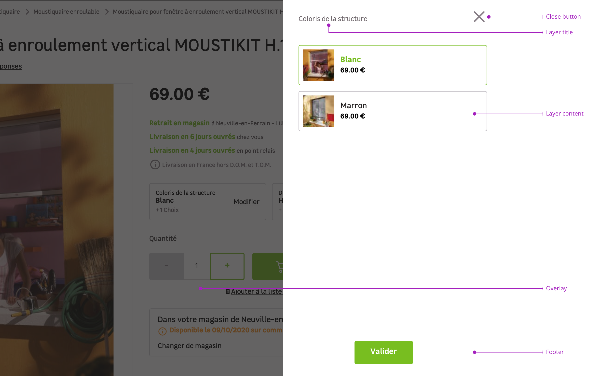

> In modern layouts, a layer is a way to give further actions or display to the user specific content without breaking the user flow, like login or cart overview.

## Usages

<Highlight type="warning" title="Be aware">
  Never use a layer as way to hide content from the user.
</Highlight>

Here are a few examples of layers use cases to know this component better:

- **Login:** as a way to avoid to break the user's flow in some specific cases. For example, when the user needs to login to go further.
- **Cart overview:** to display the cart without breaking the user flow.
- **List:** to display large amount of informations and allow the user to make a choice.

<Highlight type="tips" title="Keep data in mind">
  Layers can be a great way to offer option choice to the user but keep in mind
  that it must depend on the data. It is useless to use a layer for just simple
  color choice but a layer can be great if you need to give visual indications
  to the user.
</Highlight>

<Story id="overlay-layer--default" height="750" />

## Overview

Layers are a combination of the following elements:

- A layer title
- A content
- A layer footer with actions (actions are optional)
- An overlay

### Layer title

The layer title should recall the action clicked by the user.

### Content

Depending of the context, it can be a login, a cart preview, a list, etc.

### Layer footer

The footer section is where you will find the call to action button(s). You will find different variations to suit your needs such as:

- A single call to action button
- A primary call to action button accompanied with a secondary button to give the user an alternative
- A primary call to action button with a link to redirect the user to a page to give more informations

### Overlay

Layers must be used with an overlay to focus user's attention on the content.

## Behaviors

Layers are always displayed from the side of the page and appear above the content of the page with a dark overlay.

## Specific variation

### Extended width

In the case you have complex elements to display inside the layer and need some air, you can use an extended width for the layers from the breakpoint `M`.

<Highlight type="warning" title="Be aware">
  Never use an extended layer like an alternative of a page. Keep in mind that a
  layer is a way to give further actions or display to the user specific content
  without breaking the user flow.
</Highlight>

## Do's and Don'ts

<HintItem>Please use modals to display informative contents.</HintItem>
<HintItem dont>
  Never use a layer for a massive content, don't be afraid to change page.
</HintItem>
<HintItem dont>Never use a layer as a navigation element.</HintItem>
<HintItem dont>
  Never use a layer as way to hide content from the user.
</HintItem>
