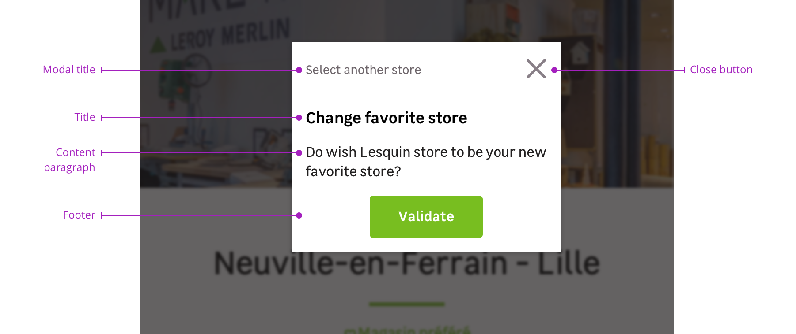
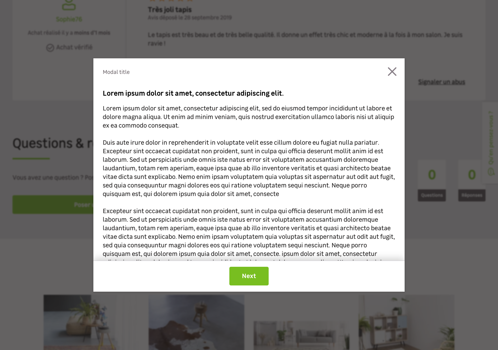

> A modal is a dialog window allowing you to focus the user's attention on a specific task, a piece of information or a mandatory action. It must be used for single action only and must have a call to action button in the bottom.

<Story id="overlay-modal--default" height="530" />

Modals should be used to:

- Give direct feedback to the user
- Ask for a specific action from the user
- Inform the user about the action that has just been done

## Overview

Modals are a combination of the following elements:

- A modal header
- A title
- A content paragraph
- A modal footer with actions
- An overlay

### Modal header

The modal header is composed by a modal title that recalls the action clicked by the user and a closing button.

### Title (Optional)

The title must be brief and explain the action the user is taking in this dialog. In some cases, you may need to use a modal without a title.

### Content paragraph

This is the text where you should inform the user what action is needed with more details.

### Modal footer

The footer section is where you will find the call to action button(s). It is a mandatory part in every modal. You will find different variations to suit your needs such as:

- A single call to action button
- A primary call to action button accompanied with a secondary button to give the user an alternative
- A primary call to action button with a link to redirect the user to a page to give more informations

### Overlay

Modals must be used with an overlay to focus user's attention on the dialog window.

## Behaviours

### Height

Please note that every breakpoint has a corresponding maximum height as detailed in this table.

| Breakpoint | Modal max-height                  |
| ---------- | --------------------------------- |
| S          | 100% (16px margin-top and bottom) |
| M          | 1:2 screen                        |
| L          | 2:3 screen                        |
| XL         | 2:3 screen                        |
| XXL        | 1:2 screen                        |

### Scroll

In some cases, the content paragraph can be bigger than the modal's viewport. A dropped shadow on the top of the footer is used to indicate to the user that this is a scrollable content.

## Specific variation

### Delete action

In specific cases, a modal can be used to confirm a destructive action.

<Highlight type="warning" title="Be careful">

Use this variation exclusively for destructive actions. Please use the default variation to notify a user that he'll abort a work in progress.

</Highlight>

<Story id="overlay-modal--delete-action" height="530" />
