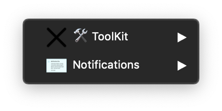
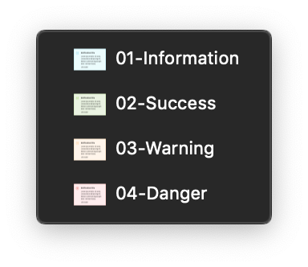

## Notifications sketch file is made of two sections :

### **🛠 ToolKit :**

The ToolKit section brings together the **dedicated symbols used for building the final symbols**, and you can find them in the symbol overrides.
 

<Hint type="dont">
  <HintItem dont>
    Never use the toolkit symbols in your project.
  </HintItem>
</Hint>

### **Notifications :**

This is the section where you will find the ready to use symbols for your projects. You can find the different types of the notifications.

- Information
- Success
- Warning
- Danger
