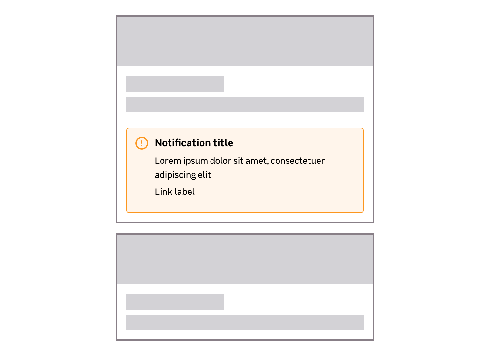

> Notifications are used to bring the user's attention on a piece of information that needs to be known. A notification is usually the result of an action made by the user.

The notification component is made of:

- **An icon:** In addition to the frame color, it allows to specify the degree of importance.
- **A title _(optional)_:** Concise and precise, to quickly guide the user.
- **A paragraph:** To complete the title to be more precise, or indicate the actions to follow.
- **One or some actions _(optional)_:** A link or button(s) can be used when users need to do an action.

<Highlight type="warning" title="Be aware">

For SEO & accessibility reasons, a paragraph is always required inside a notification.

</Highlight>

<Story id="indicator-notification--default" />

## Types

> To learn more about the colors usage, please read the [color documentation](/foundations/colors/).

### Information

Informational notifications are **blue**. They are used to highlight a piece of relevant information but don't require immediate action.

<Story id="indicator-notification--default" />

### Success

Success notifications are **green**. They are used when an action is successful.

<Story id="indicator-notification--variation-success" />

### Warning

Warning notifications are **orange**. They warn the user about important information that deserves caution.

<Story id="indicator-notification--variation-warning" />

### Danger

Danger notifications are **red**. They are used to warn the user of an error or a problem. This may require immediate action.

<Story id="indicator-notification--variation-danger" />

## Variations

### Sizes

Notifications are available in two sizes.

#### Small

This size is less common and must be used inside a box only. The message or required action must be related to the content of the box.

<Story id="indicator-notification--size-small" />

#### Medium (default)

This is the default variation to use in most cases and is mainly positioned at the top of a page.

### Actions

#### Link

Use a link when the message indicates an action to do on a different page.

<Story id="indicator-notification--with-link" />

#### Button

Use a button when the message indicates an action to do immediately.

<Story id="indicator-notification--with-button" />

### Closable notifications

In specific cases, you can use a closable notification in your project.

<Highlight type="warning" title="Be aware">

Closable notification can be used with the medium size variation only.

</Highlight>

<Story id="indicator-notification--closable" />

## Do's and Don'ts

<HintItem>
  Always use the type of notification that matches the displayed message.
</HintItem>
