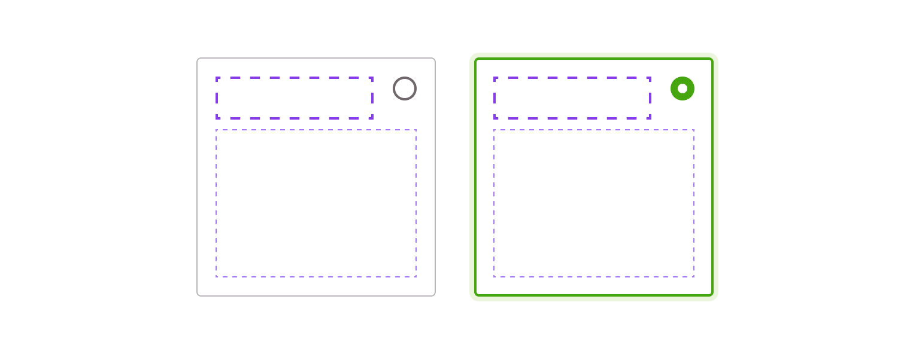

> The option card component allows confronting some options of an item (product or service) and can be used to set up or even filter a selection. The content of each option card must be a comparable synthesis to help the user make a choice.

<Story id="option-group-optioncard--default" />

<Highlight type="warning" title="Be aware">

Please, don't confuse the option card with the [Card component](/Components/Cards), which has different usage.

</Highlight>

## Variations

The component provides a default frame and its selected state. Please note that the structure can't be overridable.
From an accessible and inclusive way, the option group always contain a checkbox for the multiple choices or a radio button for the single choices.

### Single select

<Story id="option-group-optioncard--default" />

### Multi-select

<Story id="option-group-optioncard--multi-select" />

### Padding

There are two sizes of padding for the option card.

| Size             | Value       |
| ---------------- | ----------- |
| Small            | 0.5mu (8px) |
| Medium (default) | 1mu (16px)  |

<Highlight type="warning" title="Be aware">

Paddings aren't overridable to keep consistency through products.

</Highlight>

<Story id="option-group-optioncard--variation-small" />

### Centred version

Depending on your need, radio buttons and checkboxes can be vertically centred.

<Story id="option-group-optioncard--variation-centered" />

## Behaviours

### Text content

The content should be short and readable to help users to compare it quickly and easily.

### Interaction

For accessibility reasons, each option card must be fully clickable. Please, don't display secondary actions inside unselected ones.

### Specific actions

Depending on the context, a button or a link can appear if the option card is selected.

<Highlight type="tips" title="Good to know">

In case you have to associate a button (or a link) to an unselected option card, it must be displayed outside of the component, for example, below it.

</Highlight>

## Do's and Don'ts

<HintItem dont>
  Never use a button or a link inside an unselected card.
</HintItem>
