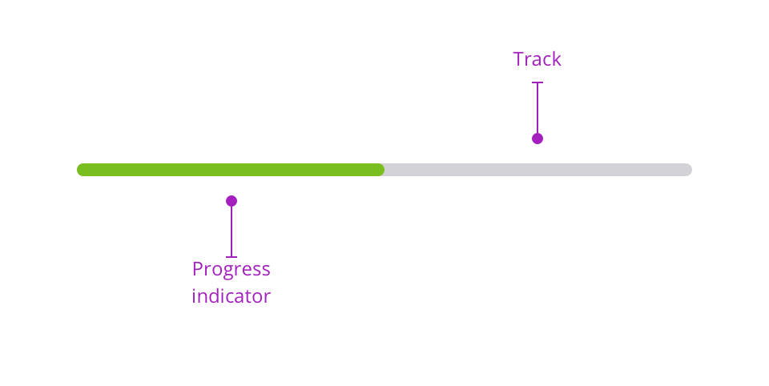

> A progress bar allows you to focus the attention of the user with a visual clue on his progress in a particular journey.

## Variations

### Linear progress

Linear progress embodies the idea of clearing a path. It can be used during long surveys to visually materialise the progress of the user in a particular journey. The linear progress bar is made of two distinctive elements:

- track: symbolised by a grey bar to demonstrate the path that still has to be made.
- progress: embodies the progress the user has made so far.

#### Default version

This version is the most accessible version of this pattern. We used `$color-info-600` color to illustrate the informative goal of this progress bar. You can choose between two different sizes for this pattern. Smaller size is perfect for indicating a progress inside a table and medium size can be added in a stepper for long user journeys.

<Story id="indicator-progress-bar--default" />

### Percentage progress

The percentage progress bar version is used when you need to tell the exact progression the user has made. This version has the same track and progress elements with the percentage number centered.

<Story id="indicator-progress-bar--percentage-shown" />

<Highlight type="tips" title="Pourcentage font color">

Please note that you will have to change the font-color from `G900` to `G000` when the progress is more than 51%.

</Highlight>
