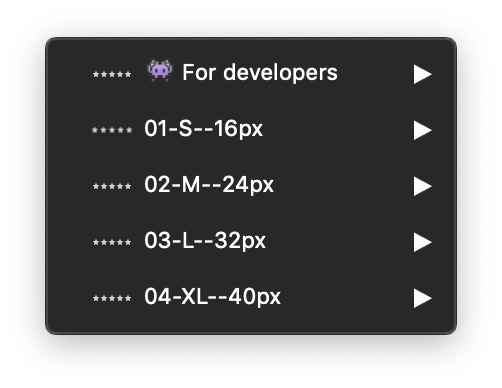
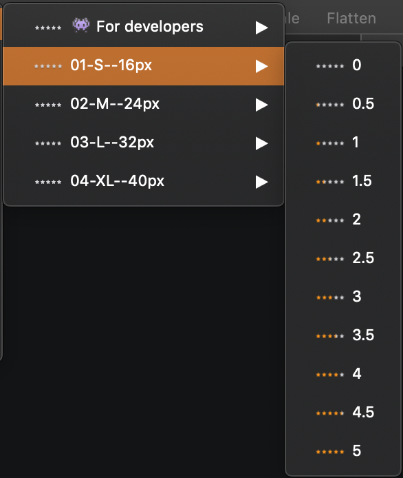

## Rating stars sketch file is composed of five sections:

### 👾 For developers:

This part is a specific section for developers, **for a better accessibility**. These are all states of Mozaic rating stars.

_They are all available with the **hover** and **focus** preview._

### Rating stars:

This is the section where you will find the ready to use symbols for your projects. You can find the different variations of the rating stars depending on the size you want to use.

- 01-S--16px
- 02-M--24px
- 03-L--32px
- 04-XL--40px
