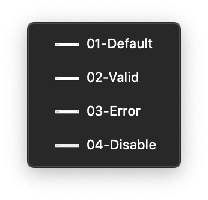

## Selects sketch file is merged with the global [BA] Forms file :

The sketch file includes other form elements. Here is the section you'll find the selects.

### 👾 For developers :

This part is a specific section for developers, **for a better accessibility**. These are all states of forms components.

### 🛠 ToolKit :

The ToolKit section bring together the **dedicated symbols used for building the final symbols**, and you can find them in the symbol overrides.
 

<Hint type="dont">
  <HintItem dont>
  Never use the toolkit symbols in your project.
  </HintItem>
</Hint>

### Selects :

This is the section where you will find the ready to use symbols for your projects. You can find the different states of the selects.

- Default
- Valid
- Error
- Disable
