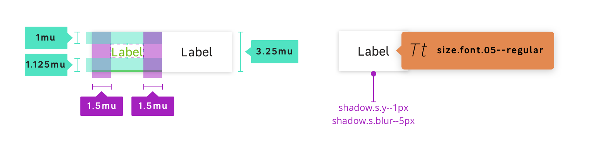

## Anatomy

## Properties

### Layout / size

| Variations                  | Height       | Paddings                  | Font-size             |
| --------------------------- | ------------ | ------------------------- | --------------------- |
| **Default**                 | 52px (3.25mu)| 16px (1mu) - 24px (1.5mu) | `size.font.05` (16px) |

