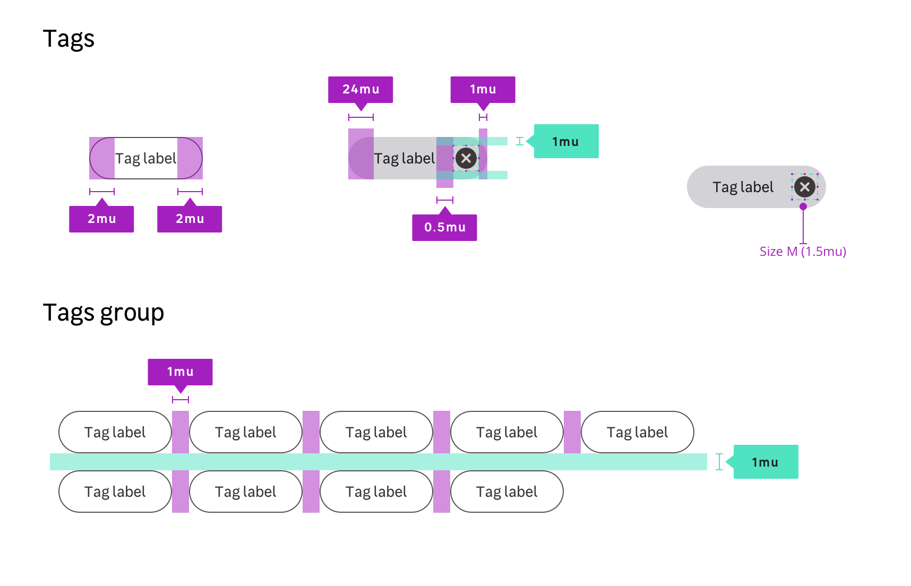

## Anatomy

## Properties

### Layout / sizes

| Size name                   | Paddings                 | Font-size             | radius    |
| --------------------------- | ------------------------ | --------------------- | --------- |
| **Small**                   | 4px 16px `$mu025 $mu100` | `size.font.04` (14px) | `0.75rem` |
| **Medium** _(Default size)_ | 8px 16px `$mu050 $mu100` | `size.font.04` (14px) | `1rem`    |

### Colors

#### Text tag

| theme     | Property         | Token                             | value     |
| --------- | ---------------- | --------------------------------- | --------- |
| **light** | background-color | `color.tag.text.light.background` | `#ffffff` |
| **light** | border-color     | `color.tag.text.light.border`     | `#554f52` |
| **light** | text color       | `color.tag.text.light.text`       | `#554f52` |
| **dark**  | background-color | `color.tag.text.dark.background`  | `#000000` |
| **dark**  | border-color     | `color.tag.text.dark.border`      | `#ffffff` |
| **dark**  | text color       | `color.tag.text.dark.text`        | `#ffffff` |

#### Link tag

| theme     | state   | Property         | Token                                    | value     |
| --------- | ------- | ---------------- | ---------------------------------------- | --------- |
| **light** | default | background-color | `color.tag.selectable.light.background`  | `#ffffff` |
| **light** | default | border-color     | `color.tag.link.light.border`            | `#554f52` |
| **light** | default | text color       | `color.tag.link.light.text`              | `#554f52` |
| **light** | hover   | background-color | `color.tag.link.light.hover.background`  | `#eeeef0` |
| **light** | active  | background-color | `color.tag.link.light.active.background` | `#d3d2d6` |
| **dark**  | default | background-color | `color.tag.link.dark.background`         | `#000000` |
| **dark**  | default | border-color     | `color.tag.link.dark.border`             | `#ffffff` |
| **dark**  | default | text color       | `color.tag.link.dark.text`               | `#ffffff` |
| **dark**  | hover   | background-color | `color.tag.link.dark.hover.background`   | `#3c3738` |
| **dark**  | active  | background-color | `color.tag.link.dark.active.background`  | `#554f52` |

#### Selectable tag

| theme     | state    | Property         | Token                                            | value     |
| --------- | -------- | ---------------- | ------------------------------------------------ | --------- |
| **light** | default  | background-color | `color.tag.selectable.light.background`          | `#d3d2d6` |
| **light** | default  | text color       | `color.tag.selectable.light.text`                | `#222020` |
| **light** | hover    | background-color | `color.tag.selectable.light.hover.background`    | `#add585` |
| **light** | active   | background-color | `color.tag.selectable.light.active.background`   | `#41a017` |
| **light** | disabled | background-color | `color.tag.selectable.light.disabled.background` | `#eeeef0` |
| **light** | disabled | text color       | `color.tag.selectable.light.disabled.text`       | `#887f87` |
| **light** | selected | background-color | `color.tag.selectable.light.selected.background` | `#78be20` |
| **dark**  | default  | background-color | `color.tag.selectable.dark.background`           | `#3c3738` |
| **dark**  | default  | text color       | `color.tag.selectable.dark.text`                 | `#ffffff` |
| **dark**  | hover    | background-color | `color.tag.selectable.dark.hover.background`     | `#78be20` |
| **dark**  | active   | background-color | `color.tag.selectable.dark.active.background`    | `#0a601b` |
| **dark**  | disabled | background-color | `color.tag.selectable.dark.disabled.background`  | `#554f52` |
| **dark**  | disabled | text color       | `color.tag.selectable.dark.disabled.text`        | `#887f87` |
| **dark**  | selected | background-color | `color.tag.selectable.dark.selected.background`  | `#158110` |

#### Removable tag

| theme     | state   | Property         | Token                                         | value     |
| --------- | ------- | ---------------- | --------------------------------------------- | --------- |
| **light** | default | background-color | `color.tag.removable.light.background`        | `#d3d2d6` |
| **light** | default | text color       | `color.tag.removable.light.text`              | `#222020` |
| **light** | default | icon color       | `color.tag.removable.light.icon`              | `#3c3738` |
| **light** | hover   | background-color | `color.tag.removable.light.hover.background`  | `#bab6bc` |
| **light** | active  | background-color | `color.tag.removable.light.active.background` | `#a19ba2` |
| **dark**  | default | background-color | `color.tag.removable.dark.background`         | `#3c3738` |
| **dark**  | default | text color       | `color.tag.removable.dark.text`               | `#ffffff` |
| **dark**  | default | icon color       | `color.tag.removable.dark.icon`               | `#d3d2d6` |
| **dark**  | hover   | background-color | `color.tag.removable.dark.hover.background`   | `#554f52` |
| **dark**  | active  | background-color | `color.tag.removable.dark.active.background`  | `#6f676c` |
