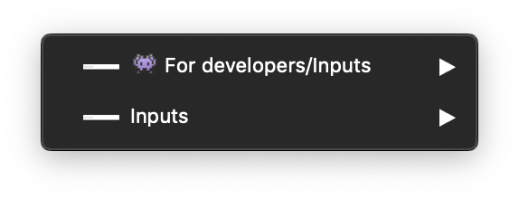
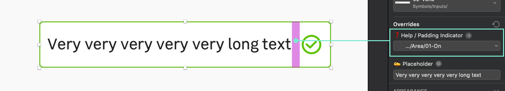

## Buttons sketch file is composed of two sections :

### **👾 For developers :**

This part is a specific section for developers, **for a better accessibility**\* these are all states of Leroy Merlin's inputs :

- Default
- Valid
- Error
- Disable

\*_They are all available with the **hover** and **focus** preview._

### **Inputs :**

Here is the ready-to-use symbols for your LEROY MERLIN projects, you can find **all the inputs with all possible variations** :

- Default
- Valid
- Error
- Disable

> **Good to know :**
>
> On the valid and error input symbols, there is an override named **"❓Help / Padding Indicator"** who's dedicated to help the designer know the padding between the label and the icon.
>
> 

 
