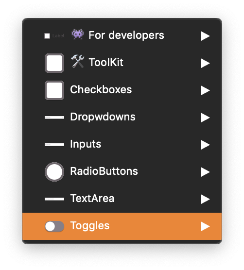

## Toggle sketch file is merged with the global [BA] Forms file :

The sketch file includes other form elements. Here is the section you'll find the toggle :

### **👾 For developers :**

This part is a specific section for developers, **for a better accessibility**. These are all states of Leroy Merlin's toggle :

- Off:Default
- On:Default
- Off:Disable
- On:Disable

_They are all available with the **hover** and **focus** preview._

### **🛠 ToolKit :**

The ToolKit section brings together the **dedicated symbols used for building the final symbols**, and you can find them in the symbol overrides.
 

<Hint type="dont">
  <HintItem dont>
  Never use the toolkit symbols in your project.
  </HintItem>
</Hint>

### **Toggle :**

This is the section where you will find the ready to use symbols for your LEROY MERLIN's projects. You can find the different states of the toggle.

- Off
- On
