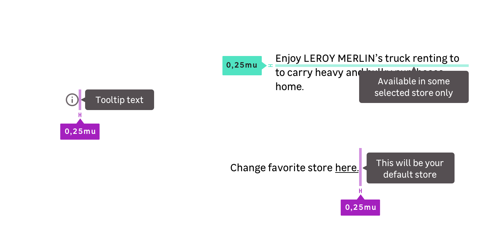

## Spacing

Spacing is a very important part of visual consistency. You'll find the right spacing to use in the following images.

The default spacing is 0,25mu (4px) from graphic elements like icons and text elements.

