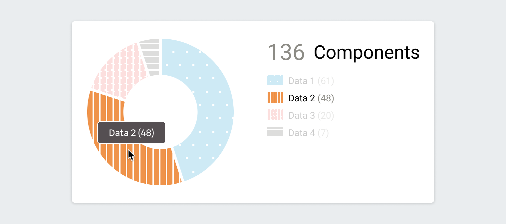
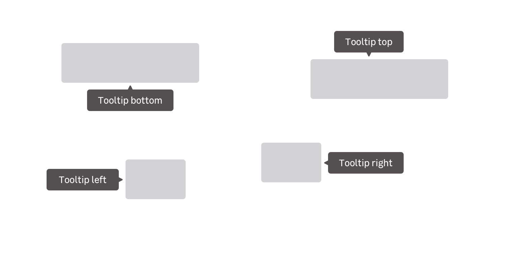

> A tooltip allows you to display further information to the user when needed. It can also be used to explicitely specify a visual element like an icon.

<Highlight type="warning" title="Mobile usage">
  Keep in mind that the current version of the tooltip is not mobile-friendly.
  Please, prefer its usage on desktop-only products or as an unessential
  element.
</Highlight>

<Story id="indicator-tooltip--default" />

## Usage

Please, follow these simple rules when using tooltips:

- A tooltip must be used near the highlighted content
- The tooltip text must be short (1 or 2 lines maximum)

## Variations

### Text tooltip (default)

The Text tooltip is an additional content used to define an unclear term.

### Icon tooltip

This kind of tooltip is displayed when a user needs more information, such as understanding an UI element's purpose. It is usually triggered with an informative icon placed near the UI element.

## Specific variation

### Without pointer

In less common cases, a tooltip should cover a large area and follow the mouse pointer. For example, on Dataviz elements like a slice of a Donut Chart.

<Story id="indicator-tooltip--tooltip-no-pointer" />

## Behaviors

### Directional

Four tooltip positions are provided to suit your needs at best:

- Left
- Right
- Top
- Bottom

### Appearance

Tooltips can appear in several ways depending on the context and the device it is displayed on. You can have tooltips appearing on hover, on focus and on click.

<Highlight type="tips" title="Spacings for designers">

Read more about spacings in this [design documentation page](/components/tooltip/design/)

</Highlight>

## Do's and Don'ts

<HintItem do>Show read-only content in tooltips.</HintItem>

<HintItem dont>Don't hide essential informations in tooltips.</HintItem>

<HintItem dont>
  Never use interactions in tooltips like images, links and buttons in tooltips.
</HintItem>
