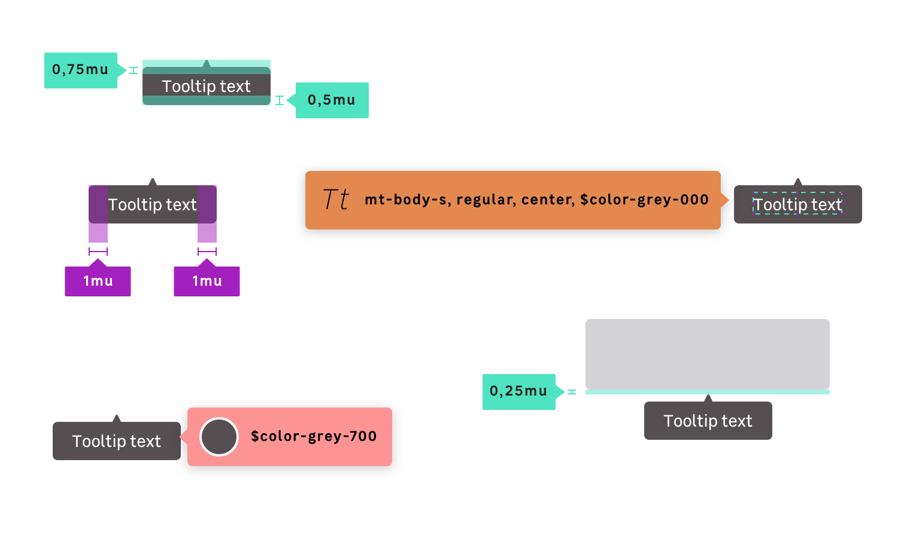

## Anatomy

## Properties

### Layout / size

| Variations                  | Height       | Paddings                  | Font-size             |
| --------------------------- | ------------ | ------------------------- | --------------------- |
| **Default**                 | 52px (3.25mu)| 16px (1mu)                | `size.font.04` (14px) |

### Color

| Variations                  | Background        | Text color                |
| --------------------------- | ----------------- | ------------------------- |
| **Default**                 | `$color-grey-700` | `$color-grey-000`         |

