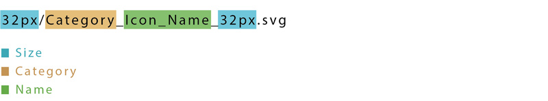
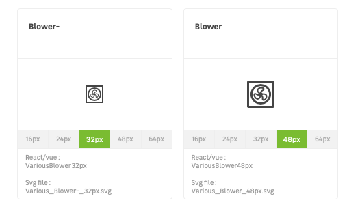

> We have divided this page in two different sections depending on what your profile is. If you're a designer working on Mozaic just go down in [this section](/contributing/designers/add-new-icons/#im-a-designer-working-on-mozaic). If you're a designer using Mozaic for your work please read the following lines.

# I'm a designer using mozaic

Before wanting to add a new icon you should ask yourself if that's a real need or just a desire. Our icons must be easy to understand and have a real meaning. That is why we encourage you to ask yourself this question: Does my user need this icon ? When this question is solved you should know a few things about our [process](/contributing/submit-changes/add-new-pattern/). Every icon produced for Mozaic by yourself or our designers in charge will have to answer these [foundations](/Foundations/Icons/designers/) and will be reviewed by our team.

Now that you know you need this new icon please [get in touch](/contributing/designers/add-new-icons/#1-get-in-touch-with-mozaics-team) with Mozaic's design team. As far as tools are concerned we work with Adobe Illustrator and Sketch to do the whole process.

# I'm a designer working on Mozaic

First of all, each icon must be reviewed by the designer(s) in charge of the quality and the consistency of the icons at LEROY MERLIN. Second of all, each new icon must be declined in the following sizes: `24px`, `32px`, `48px` & `64px`. Here are the steps that you must follow to add new icons in Mozaic.

We would like to advise you to read this [documentation](/Foundations/Icons/designers/) about icons design principles before getting in touch with Mozaic to add new icons in the design kit. This will definitely help you to understand our vision when it comes to icons and it will make the process way easier for both parties.

## 1. Get in touch with Mozaic's team

It's important to discuss your needs and what can be produced together before starting to create the preivously mentioned icon. Our icon designers are available on Slack (#mozaic-support). Get in touch with them to speak about format and sizes of your icon(s). You can also reach Mozaic's team on different [channels](/help/).

## 2. Icon design phase

This is the point where the icon is designed either by you or our design team.

## 3. New branch on GitHub

You must create a branch to be able to push your work in Mozaic's design system repository. We advise you to name it `feat-YYWW-icons` (feat-1949-icons) to follow our [branch naming guidelines](/contributing/developers/git-conventions/#branch-names).

## 4. Place your icon(s) in Mozaic's repository

You should replace the entire Icons directory inside the **mozaic-design-system** repository in the `src/icons/` directory.**Any changes in the icon names or directory structure may cause bugs in production**.  
Be sure to have the **latest curated and cleaned icon directory**, and add the icon you desire to update.

## 5. We've built a script for you to search for potential errors

This script will locate errors so you can fix them the easiest way possible. Please type the following lines in your terminal:

- `cd FolderName/GitHub/mozaic-design-system`
- `npm run lerna` (more informations can be found [here](/get-started/developers/installation/) if it's your first time)
- `npm run icons:build`

Please check for this kind of error in your terminal.

```
✗ ERROR : in MediaFullScreen_32 px.svg : icon file name should start with a category name separated by _ with the icon name
✗ ERROR : in MediaFullScreen_32 px.svg : icon file name should not contain spaces
✗ ERROR : in MediaFullScreen_32 px.svg : icon file name should always end with _[size]px.svg
✗ ERROR : in MediaFullScreen_32 px.svg :  found in /16px/ directory. Icon file name is either wrong or the icon is in the wrong directory
```

**Keep in mind that the script cannot detect all errors**, and you need to check that icons are respecting the following rules :

### Icon validation rules



#### Size rules

- It should be placed in the directory related to his size : `32px/....svg`.
- The file name should finish with an underscore, followed by the size : `_32px`.
- The SVG file should contain a `viewbox` attribute that equal the icon size : `viewbox="0 0 32 32"`.

#### Category name rules

- The icon file name should start with a category name followed by an underscore : `Category_(...).svg`.
- The category should start with a capital letter.
- The category should not contain underscore and be only one word : `CategoryName`, `Category-name` and `Category_name` are not allowed.

#### Name rules

- The name should start with a capital letter (A-Z).
- The name should not start with a number : `360` is forbiden.
- The name can contain underscores and dashes : `Icon-Name_with--Dashes`.

#### Vectors and structure rules

- The icon should be built with two layers nammed `Square` and `Icon` (The Square layer will be removed by our optimisation script).
- The `Square` layer contain a rectangle with the exact corresponding width and height of the icon (ex: `32px`).
- The `Icon` layer should contain flattened vectorial paths and shapes with no strokes.
- For monochrom icons, there should be only one color in the `Icon` layer.

#### Export rules :

- Do not optimize the vector paths when exporting, our script will do it for you.

#### Directory structure :

In src/icons :

```
COLORS/
├── PDF/
│   ├── 24px/
│   │   ├── Category_name_24px.pdf
│   │   └── ...
│   └── ...
└── SVG/
│   ├── 24px/
│   │   ├── Category_name_24px.svg
│   │   └── ...
│   └── ...
PDF/
├── 16px/
│   ├── Category_name_16px.pdf
│   └── ...
└── ...
SVG/
├── 16px/
│   ├── Category_name_16px.svg
│   └── ...
└── ...
```

## 6. Solve potential errors

Mozaic's repository will be locally stored in your computer usually under the folder `GitHub`. This is where you can solve the potential errors directly in this folder.

## 7. Please do a final visual check on the style guide

With the following terminal command you will be able to build a local version of the style guide that visually looks like the online website. That will allow you to do a final visual check on this built style guide to make sure that everything looks right.

Type this in your terminal:

- `npm run develop`

After the process is done go to `Foundations/Icons/Preview` on the built styleguide.

For example, if you have done a naming typo like `Various_Blower-_32px.svg` instead of `Various_Blower_32px.svg` it will duplicate your icon in this page and will look like the following image.



## 8. Commit and push your branch

To be available, your branch needs to have a commit and be pushed. Please read [our commit guidelines](/contributing/developers/git-conventions/#commit-message) for more efficiency.

## 9. Make a pull request

To finish the process and make the whole Mozaic team review your work, you need to make a pull request with the following labels :

- `scope: pattern`
- `feat`
- `skill:design`

For example, this pull request can be named: `feat(pattern/icons): add week 49 icons`.

Feel free to read this [page](/contributing/developers/git-conventions/#pull-requests) if you need more informations.
