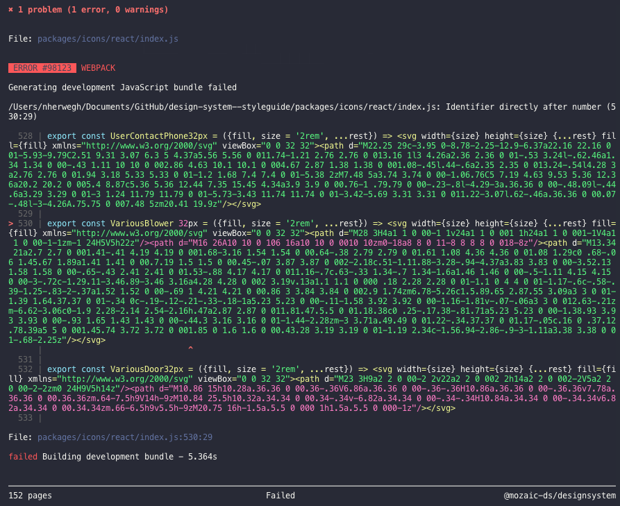

First of all, each icon must be reviewed by the designer(s) in charge of the quality and the consistency of the icons at LEROY MERLIN. Second of all, each new icon must be declined in the following sizes: `24px`, `32px`, `48px` & `64px`. Here are the steps that you must follow to add new icons in Mozaic.

## 1. Get in touch with Mozaic's team

It's important to discuss your needs and what can be produced together before starting to create the said icon. Our icon designer is Simon Roger (mail) for now. You will be able to speak about format and sizes with him.

## 2. Icon design

This is the point where the icon is designed either by you or our design team.

## 3. New branch on GitHub

You must create a branch to be able to push your work in Mozaic's design system repository. You advice you to name it like this `YYWW-icons` (1949-icons).

## 4. Place your icon(s) in Mozaic's repository

Your icons need to put in the design-system--styleguide repository in this folders `/src/Icons/YourSize`.

## 5. We've built a script for you to search for potential errors

| cd Documents/GitHub/design-system--styleguide
| yarn install
| yarn develop

Please check for this kind of error in your terminal.

## 6. Solve potential errors

You can solve the potential errors directly in your computer's folder as a regular file.

## 7. Please do a final visual check on the style guide

Step 5 will build a local version of the style guide that visually looks like the online website. You will be able to do a final visual check on this built style guide to make that everything looks right. You will just have to go to this page to have a preview of every icon:Foundations/Icons/Preview.
For example, if you have done a naming typo like `Various_Blower-_32px.svg` instead of `Various_Blower_32px.svg` it will duplicate your icon in this page and will look like the following image.

## 8. Commit and push your branch

To be available, your branch needs to have a commit and be pushed. Please read [our commit guidelines](link) for more efficiency.

## 9. Make a pull request

To finish the whole process and make the whole Mozaic team review your work, you need to make a pull request. More info ?
