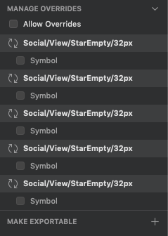
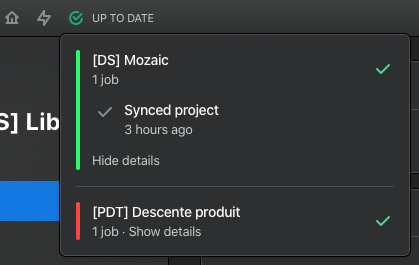
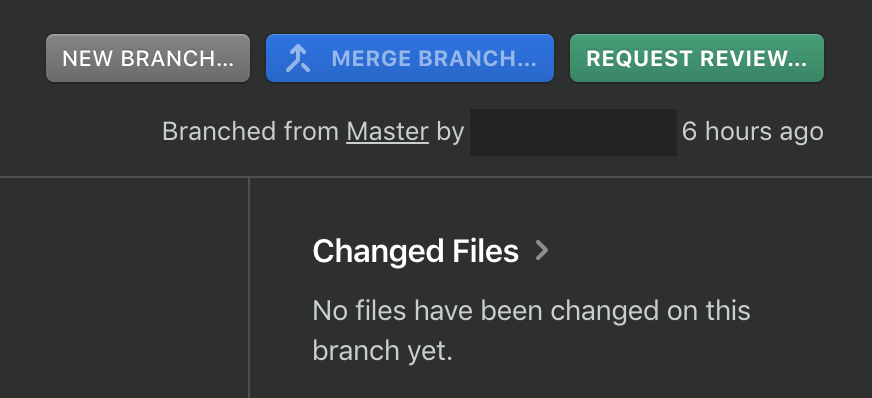

# Prototype tools

> Mozaic is a worldwide source of truth when it comes to design for Adeo and Leroy Merlin's products. That is why you need to use general guidelines when you contribute to Mozaic. We made some rules to follow when designing new symbols.

## Sketch

This **Definition of Done** page has been divided in 10 steps.

### 1. The pattern doesn't exist in Mozaic

I checked that the pattern is not in another library or in a current issue :

- I looked over Mozaic’s website ([Foundations](/foundations/) / [Components](/components/))
- I checked on GitHub ([Pull requests](https://github.com/adeo/mozaic-design-system/pulls))
- I checked on [Jira](https://design-system-adeo.atlassian.net/secure/RapidBoard.jspa?rapidView=1&projectKey=MZC&atlOrigin=eyJpIjoiYTI4ZDJhMmU2MTE1NGQyN2FmNWQxYTE3MjkzODAwMjUiLCJwIjoiaiJ9) (Issues in the kanban board)

### 2. The pattern is stored in the right file

I checked that my pattern is in the right Sketch library and it’s in somewhere that makes sense.

### 3. The naming conventions have been respected in my file

A design system needs to respond to a certain number of criterias. Naming conventions is one of the most important. It helps file organization and generates a common language.

> Please read the [naming convention documentation](/get-started/designers/#file-naming-convention) to find out more informations about that.

### 4. Every symbols are usable and responsive

Before asking for review you need to make sure that every symbol in your library is usable and responsive. Usable means that the symbol will be quickly understood by the designers. Responsive means that the symbol can be resized depending on your needs.

> Here is a [tutorial](https://www.sketch.com/docs/layer-basics/constraints/) to use resizing constraints in Sketch.

### 5. Layer styles and text styles have been applied on the different components

We created layer and text styles to make the symbol creation process easier. Make sure to use it, the second time it will be easier that the first time 🤘. This will also make the update process way faster.

### 6. Paddings and margins use magic unit values (1mu = 16px)

Every element must use our magic unit standard which is 1 magic unit for 16 pixels.

> Please read the [Magic Unit documentation](/foundations/spacing/magic-unit/) to find out more informations about that.

### 7. Every patterns coming from other libraries are up to date

Thank you for checking that every patterns are up to date (look after the “Library update” notifications in Sketch 🤓).

> Please read [Sketch documentation](https://www.sketch.com/docs/libraries/library-updates) to find out more informations about that.

### 8. Layers are well organized and follow our guidelines

Layers should be organized in a top to bottom reading direction to make the override process easier. For example, the header needs to be on top of the layer list and the footer on the bottom of this list. That corresponds to **top to bottom and left to right**.

> You can use some Sketch plugins to make this process easier. A very simple one called [Sort Me](https://github.com/romashamin/sort-me-sketch/archive/master.zip) and way more complete called [Automate](https://github.com/Ashung/Automate-Sketch/archive/master.zip).

### 9. Non editable elements of the symbols are not available in the override panel

When symbol elements can’t be edited you need to lock the possibility to override them. This can be done easily with Sketch when you click on the symbol’s artboard.



### 10. I followed the logic of atomic design to build my symbol

When an element is used twice, you need to create a symbol that will be usable and repeated in the final symbols. This will make the modification process faster when you need to update the component.

You can download the [designer kit](https://github.com/adeo/design-system--styleguide/releases/download/v1.0.1-alpha.19/designer-kit.zip) to check how the symbols are built. Every Sketch file we produce is built the same way.

## Figma

This **Definition of Done** page has been divided in 9 steps.

### 1. The pattern doesn't exist in Mozaic

I checked that the pattern is not in another library or in a current issue :

- I looked over Mozaic’s website ([Foundations](/foundations/) / [Components](/components/))
- I checked on GitHub ([Pull requests](https://github.com/adeo/mozaic-design-system/pulls))
- I checked on [Jira](https://design-system-adeo.atlassian.net/secure/RapidBoard.jspa?rapidView=1&projectKey=MZC&atlOrigin=eyJpIjoiYTI4ZDJhMmU2MTE1NGQyN2FmNWQxYTE3MjkzODAwMjUiLCJwIjoiaiJ9) (Issues in the kanban board)

### 2. The pattern is stored in the right file

I checked that my pattern is in the right Figma library and it’s in somewhere that makes sense.

### 3. The naming conventions have been respected in my file

A design system needs to respond to a certain number of criterias. Naming conventions is one of the most important. It helps file organization and generates a common language.

> Please read the [naming convention documentation](/get-started/designers/#file-naming-convention) to find out more informations about that.

### 4. Every components are usable and responsive

Before asking for review you need to make sure that every component in your library is usable and responsive. Usable means that the component will be quickly understood by the designers. Responsive means that the component can be resized depending on your needs.

> Here is a [tutorial](https://help.figma.com/article/54-constraints) to use resizing constraints in Figma.

### 5. Layer styles and text styles have been applied on the different components

We created layer and text styles to make the component creation process easier. Make sure to use it, the second time it will be easier that the first time 🤘. This will also make the update process way faster.

### 6. Paddings and margins use magic unit values (1mu = 16px)

Every element must use our magic unit standard which is 1 magic unit for 16 pixels.

> Please read the [Magic Unit documentation](/foundations/spacing/magic-unit/) to find out more informations about that.

### 7. Every patterns coming from other libraries are up to date

Thank you for checking that every patterns are up to date (look after the “Component updates available” notifications in Figma 🤓).

> Please read [Figma documentation](https://help.figma.com/article/314-accepting-updates-from-your-team-library) to find out more informations about that.

### 8. Layers are well organized and follow our guidelines

Layers should be organized in a top to bottom reading direction to make the override process easier. For example, the header needs to be on top of the layer list and the footer on the bottom of this list. That corresponds to **top to bottom and left to right**.

### 9. I followed the logic of atomic design to build my component

When an element is used twice, you need to create a master component that will be usable and repeated by its instances on other components. This will make the modification process faster when you need to update the component.

You can download the [designer kit](https://github.com/adeo/design-system--styleguide/releases/download/v1.0.1-alpha.19/designer-kit.zip) to check how the components are built. Every Figma file we produce is built the same way.

# Abstract

> From a designer point of view, Mozaic is based on Sketch and Abstract. Abstract is a versioning software for design files and allows teams to collaborate with a modern workflow. Like a developer does in GitHub, you need to ask for a review before merging your branches. We wrote some rules to follow before clicking **_Request Review_** on Abstract.

## 1. The symbols have been created following the Definition Of Done previously evoked.

We wrote some definition of done rules when you create some symbols in Sketch. Please read these instructions before submitting a review on Abstract. It will make the process way easier for us and we thank you for that 🤘.

## 2. Don't forget to check if Abstract is `Up to date`



## 3. Commits are meaningful

Commits are a testimony of your work on your files. Use them to make a summary of what's been done during the creation process.

## 4. Branch summary

Here is a branch summary to enter in the **Summary** section in Abstract when submitting a `Request Review`.

```
## Request Review Checklist
Please check if your Request Review fulfills the following requirements:
- [ ] The commits are meaningful
- [ ] Symbols follow the Definition of Done for Symbols

## Request Review Type
What kind of behaviour and change does this branch introduces?

## Other information (optional)
```

## 5. Don't forget to click the `Request Review` button


