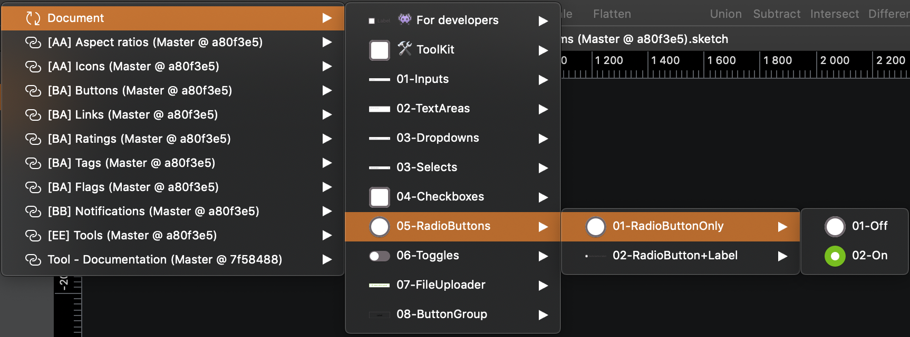
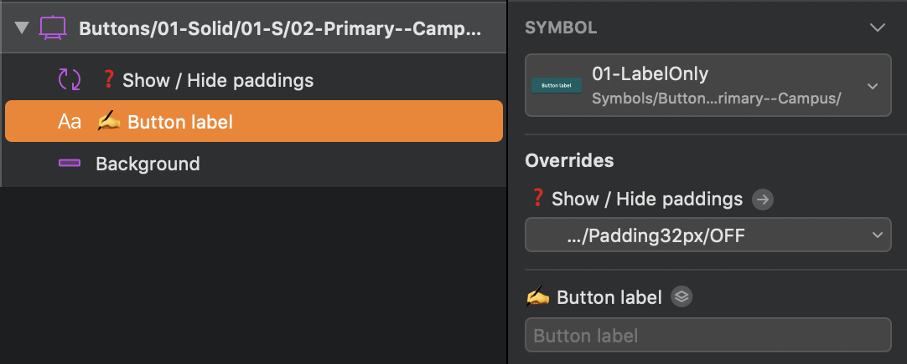

> Mozaic is a product used by a lot of people. When so many people work together from different places on such a big project, you need to establish some ground rules that everyone needs to follow. These rules must be followed across every tool your team is using to create consistency and simplify the collaboration process.

We chose to use english in all our files to be understandable by the most. We also chose to use the PascalCase standard in our prototyping tools.

## File Naming Conventions

We use two letters prefixes to name our files, like `[AA] Colors.sketch`. Please read the [getting started for designers documentation](GetStarted/Designers/namingConvention) to know more.

## Sketch

Please follow these rules to have the same architecture and standards in every library. This will be very helpful for the design teams to understand every file in Mozaic.

### Symbol categorisation

We use this categorisation to create consistency in our libraries:

| Categrory             | Usage                                                                                                                                                    |
| --------------------- | -------------------------------------------------------------------------------------------------------------------------------------------------------- |
| **👾 For developers** | These symbols should not be used in your designs. They are meant to share the different states of a component with the development team.                 |
| **🛠 ToolKit**         | This section contains the symbols used to build the final symbols. They are not meant to be used directly but to be accessible through symbol overrides. |
| **Component**         | This is where you'll find the ready to use symbols of the library.                                                                                       |

 

-- Image --

**Tips to create hierarchy:**

- We use numbers as prefixes to order components depending on their importance. For example, `Button / 01-Solid / 01-S / 01- Primary`

- We use a double hyphen as suffixes to indicate a specific information. For example, `Button / 01-Solid / 01-S / 01- Primary--Campus`

### Layers naming

#### Shapes

Please use the following naming conventions for your shapes:

| Type           | Description                                                     |
| -------------- | --------------------------------------------------------------- |
| **Frame**      | Frame is the combination of a **background** and an **outline** |
| **Background** | Background is the fill of your component                        |
| **Outline**    | Outline is the border of your component                         |
| **Divider**    | This allows you to break the rhythm of the page                 |
| **Shadow**     | This allows you to create relief                                |

 

<HintItem>
  Always rename your layers to have an understable file for others.
</HintItem>

<HintItem dont="true">
  Never use layer names like rectangle, oval, etc.
</HintItem>

#### Icons

Please follow these instructions for the naming of your icon in the layer list.

|  Type                 | Icon name                       | Description                                                           |
| --------------------- | ------------------------------- | --------------------------------------------------------------------- |
| **Customisable icon** | Choose the icon here 👇         | Use this naming if your icon is overridable                           |
| **Static icon**       | Icon action (e.g: _Close Icon_) |  If your icon is not overridable please summarise what action it does |

#### Images

Two cases are available for naming images layers.

- Picture
- Illustration

**Tips for aspect ratios:**

- We recommend renaming the image layers using a referenced ratio like this: `ImageSubject-ratio` like `ProductImage-1:1` or `ArticleImage-4:3`.

#### Texts

Please gather your text layers in a group name `Content`.

This group can be just one or a combination of the following elements:

- Title
- Subtitle
- Paragraph
- Mention
- Link
- Label

-- image --

**Tips for using label naming right:**
When using _label_, please explain what label it is. For example `Button label`.

## Abstract

### Branches & child branches

The prefix must contain the last two digits of the current year and the number of the week followed by the file name:

| Convention                                                 | Example                 |
| ---------------------------------------------------------- | ----------------------- |
|  [Year.Week] File name                                     | `[19.40] Buttons`       |
|  [Year.Week] Component name + Action (Major, Minor or Fix) | `[19.40] Buttons - Fix` |

### Commits message

Commits are a testimony of your work on your files. Use them to make a summary of what's been done during the creation process.

Examples:

- Major: `Add accordion + Device if needed`
- Minor: `Refoactor for campus + Device if needed`
- Fix: `Responsive bug + Device if needed`
