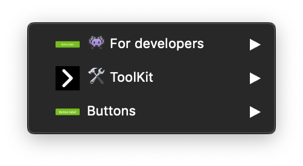

> Mozaic is a product used by a lot of people on different teams, business units and even timezones. To have a minimum of organization, we need some ground rules that everyone that wants to contribute needs to follow. These rules must be followed across every tool your team is using to create consistency and simplify the collaboration process.

English is the common language in all our files and documentation. We also chose to use the PascalCase standard in our prototyping tools.

## File Naming Conventions

We use two letters prefixes to name our files, this two letters depends on the type of pattern as you can see below: **_[XX]FileName.sketch_**

| Prefix   | Pattern type        | Description                                                                                           |
| -------- | ------------------- | ----------------------------------------------------------------------------------------------------- |
| **[AA]** | Styles              | The styles correspond to Mozaic's foundations (Colors, icons, fonts, shadows, ...)                    |
| **[BA]** | Simple Components   | The simple components are build from the styles (Buttons, links, tags, forms, ...)                    |
| **[BB]** | Complex Components  | The complex components are depending on simple components or group together several simple components |
| **[ZZ]** | Specific librairies | Tools, documentation, ...                                                                             |

## Sketch

You need to follow these rules so we can assure the same architecture and standards in every library. This will avoid rework as we will review if each pattern submitted follow these standards.

### Symbol categorisation

We use the categorisations bellow to assure consistency in our libraries:

| Categrory             | Usage                                                                                                                                                                             |
| --------------------- | --------------------------------------------------------------------------------------------------------------------------------------------------------------------------------- |
| **👾 For developers** | These symbols should not be used in your designs. They are meant to share the different states of a component with with developers.                                               |
| **🛠 ToolKit**         | This section contains the symbols created to build the pattern symbols, and they are accessible through symbol overrides. Please don't use directly this symbols in your project. |
| **Pattern name**      | This is where you'll find the ready to use symbols of the library.                                                                                                                |

 

**Tips to create hierarchy:**

- We use numbers as prefixes to order components depending on their importance (from most used to least used). For example, `Button / 01-Solid / 01-S / 01-Primary`

- We use a double hyphen as suffixes to indicate a specific information. For example, `Button / 01-Solid / 01-S / 01-Primary--Campus`

- We use t-shirt size letters to organize the patterns from the smallest to the biggest. For example, `XS` (Extra Small), `S` (Small), `M` (Medium), `L` (Large),`XL` (Extra Large).

### Layers naming

#### Shapes

Please use the following naming conventions for your shapes:

| Type           | Description                                                                  |
| -------------- | ---------------------------------------------------------------------------- |
| **Frame**      | Frame is the combination of a **background**, an **outline** or a **shadow** |
| **Background** | Background is the fill of your component                                     |
| **Outline**    | Outline is the border of your component                                      |
| **Divider**    | This allows you to break the rhythm of the page                              |
| **Shadow**     | This allows you to create relief                                             |

 

<HintItem>
  Always rename your layers to have an understable file for others.
</HintItem>

<HintItem dont="true">
  Never use layer names like rectangle, oval, etc.
</HintItem>

#### Icons

Please follow these instructions for the naming of your icon in the layer list.

|  Type                 | Icon name                       | Description                                                           |
| --------------------- | ------------------------------- | --------------------------------------------------------------------- |
| **Customisable icon** | Choose the icon here 👇         | Use this naming if your icon is overridable                           |
| **Static icon**       | Icon action (e.g: _Close Icon_) |  If your icon is not overridable please summarise what action it does |

#### Images

Two possibilities are available for naming images layers.

- Picture
- Illustration

**Tips for aspect ratios:**

- We recommend renaming the image layers using a referenced ratio like this: `ImageSubject--Ratio` like `ProductPicture--1:1` or `ArticleIllustration--4:3`.

#### Texts

Please gather your text layers in a group name `Content`.

This group can be just one or a combination of the following elements:

- Title
- Subtitle
- Paragraph
- Mention
- Link
- Label

**Tips for using label naming right:**
When using _label_, please explain what label it is. For example `Button label`.

## Figma

You need to follow these rules so we can assure the same architecture and standards in every library. This will avoid rework as we will review if each pattern submitted follow these standards.

### Component categorisation

**Tips to create hierarchy:**

- We use numbers as prefixes to order components depending on their importance (from most used to least used). For example, `Button / 01-Solid / 01-S / 01-Primary`

* We use a double hyphen as suffixes to indicate a specific information. For example, `Button / 01-Solid / 01-S / 01-Primary--Campus`

- We use t-shirt size letters to organize the patterns from the smallest to the biggest. For example, `XS` (Extra Small), `S` (Small), `M` (Medium), `L` (Large),`XL` (Extra Large).

### Layers naming

#### Shapes

Please use the following naming conventions for your shapes:

| Type           | Description                                                                  |
| -------------- | ---------------------------------------------------------------------------- |
| **Frame**      | Frame is the combination of a **background**, an **outline** or a **shadow** |
| **Background** | Background is the fill of your component                                     |
| **Outline**    | Outline is the border of your component                                      |
| **Divider**    | This allows you to break the rhythm of the page                              |
| **Shadow**     | This allows you to create relief                                             |

 

<HintItem>
  Always rename your layers to have an understable file for others.
</HintItem>

<HintItem dont="true">
  Never use layer names like rectangle, oval, etc.
</HintItem>

#### Images

Two possibilities are available for naming images layers.

- Picture
- Illustration

**Tips for aspect ratios:**

- We recommend renaming the image layers using a referenced ratio like this: `ImageSubject--Ratio` like `ProductPicture--1:1` or `ArticleIllustration--4:3`.

#### Texts

Please gather your text layers in a group name `Content`.

This group can be just one or a combination of the following elements:

- Title
- Subtitle
- Paragraph
- Mention
- Link
- Label

**Tips for using label naming right:**
When using _label_, please explain what label it is. For example `Button label`.

## Abstract

### Branches & child branches

The prefix must contain the last two digits of the current year and the number of the week followed by the file name:

| Convention                                                 | Example                 |
| ---------------------------------------------------------- | ----------------------- |
|  [Year.Week] File name                                     | `[19.40] Buttons`       |
|  [Year.Week] Component name + Action (Major, Minor or Fix) | `[19.40] Buttons - Fix` |

### Commits message

Commits are a testimony of your work on your files. Use them to make a summary of what's been done during the creation process.

Examples:

- Major: `Add accordion pattern`
- Minor: `Refactor tags for campus`
- Fix: `Responsive bug`

###
