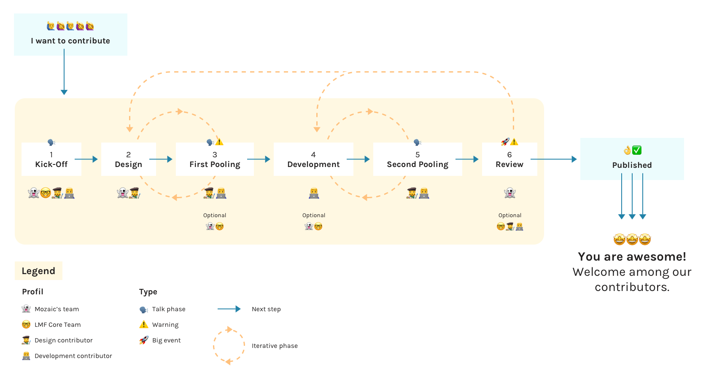

> Mozaic is a design system that wants to make designers and developers collaboration easy. By contributing to Mozaic, you become an actor of this project and can create the elements you need, without necessarily waiting for them to be made available to you by the Mozaic team.

We identified **6 phases** in this contribution funnel. Let's briefly explain what every phase is about.

# 1. KICK-OFF

### ❓ What?

The kick-off is the time where the designer and the developer sit alongside with Mozaic and LEROY MERLIN's teams. This time is very crucial because both teams will explain to the duo what's expected of them. We like to do this event **in real life**. This phase will be a workshop led by Mozaic and LEROY MERLIN core teams.

### 👩‍🚀 Who?

- Mozaic's team
- LMF Core team
- The designer and developer duo

### 🎬 How?

The duo has to ask himself "Where does this pattern go?"
What does the duo want from this pattern: they need to do a pooling on paper for the design of the pattern and have a small talk about what they want to achieve with the documentation. This will allow them to speak about technical feasibility.

### 🚀 Deliverables

- Paper sketching of the pattern
- The documentation template on a shared Google Doc

# 2. DESIGN

### ❓ What?

The design phase is a time consuming part of the contribution. For that reason, the designer will have to work on its own for a little time to do the research that is needed. The developer doesn't need to be available during this period other than just answering a few questions from the designer if he has some.

<Highlight type="tips" title="">

💡 The developer can take advantage of this period by installing the project on his environment and try to understand how the files and the documentation is structured. Feel free to contact Mozaic's tech team on Slack if you need any kind of support.

</Highlight>

### 👩‍🚀 Who?

- Designer
- Mozaic's UI support

### 🎬 How?

The designer working on this particular pattern will definitely need to pair with a Mozaic's UI.

### ⏲ How long?

This task can take up to a week to be done well for some complex patterns.

### 🚀 Deliverables

- First version of the Sketch files

# 3. FIRST POOLING

### ❓ What?

This part is very important because this is when the designer will submit his work to the developer. The developer will evaluate if the design work is technically doable. The other part of the pooling will allow them to talk about the first documentation draft. Is it still relevant and does it mean something for the end user ?

### 👩‍🚀 Who?

The duo will also have to see if the designed pattern responds to digital standards (accessibility, UX behaviour, etc.). They can ask for Mozaic's team and LMF core teams.

### 🎬 How?

The duo will be exchanging together to discuss technical and design issues **together**.

### 🚀 Deliverables

- Technical validation
- Documentation summary validated

For the designer only, **Abstract** collections with: - Spacings specs - Board with different variations (sizes, colors, states, etc.)

# 4. DEVELOPMENT

### ❓ What?

The development phase is very crucial. This is the time that will make the pattern available to our users. The developer should be able to start working on coding the pattern because the project should be installed on his environment at this point.

### 👩‍🚀 Who?

The developer helped by Mozaic's tech team and LMF core team.

### 🗓 When?

This development phase is only efficient when it's done after the first pooling validating the design of the pattern.

### 🚀 Deliverables

- Developed patterns
- Code documentation done by the developer
- Specs documentation page done by the developer

# 5. SECOND POOLING

### ❓What & 👩‍🚀 Who?

This second pooling is the time when the designer and the developer need to sit together to validate the pattern. Communicating during the whole process is very important but this time it's a necessity.

### 🎬 How?

At this point, the duo will review the whole pattern to deliver the design, the code and the documentation at once. The designer provides his documentation to the developer. Next, the developer puts the whole duo's work on GitHub.

<Highlight type="tips" title="">

Please be mindful that the designer has to give his documentation to the developer in any format. After that, this is up to the developer to transform it into a markdown file.

</Highlight>

### 🚀 Deliverables

Fully reviewed documentation: - Usage | written by the designer - Code | written by the developer - Specs | written by the developer - Design (if needed) | written by the designer

# 6. REVIEW

Now it's the waiting game. The developer will push the duo's work on GitHub to make it available to the whole community. Mozaic's core team will review the work that has been done and check if it's okay to be merged to be released.
