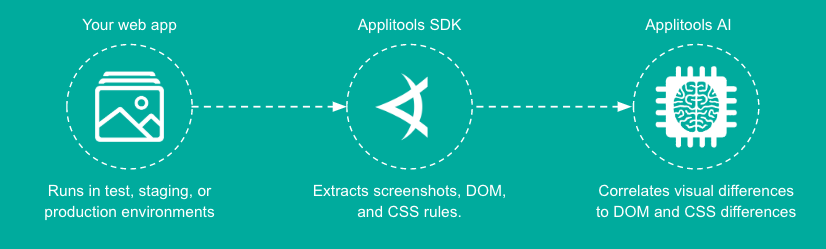
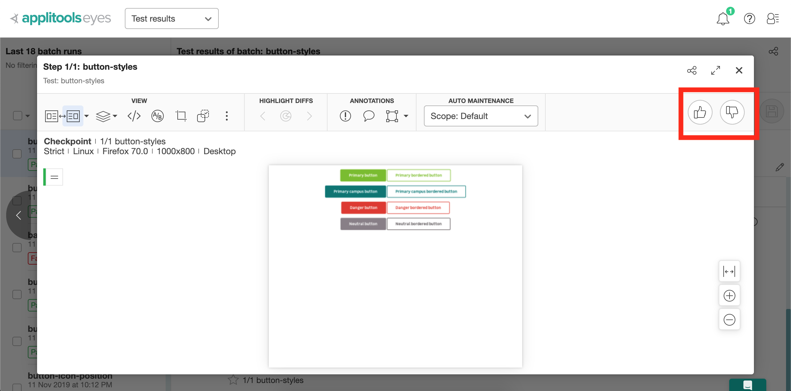
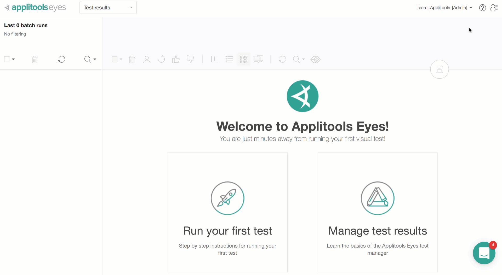

# How it works

Applitools SDKs works with existing test frameworks and simply takes screenshots of the page, element, region or an iframe and uploads them along with DOM snapshots to Applitools Eyes server. 
Applitools then compares them with previous test executions screenshots (aka Baselines) and tells if there is a bug or not. It's that simple!

# Analyzing differences
## Baseline vs. Checkpoint images
When the tests are run for the first time, Applitools server simply stores those first set of screenshots as Baseline images.
When you run the same test again, Applitools server will compare the new set of screenshots (aka Checkpoint images), with the corresponding Baseline images and higlights differences in pink color.

## Marking the test as "Pass" or "Fail"
When Applitools compares the baseline and the checkpoint image, if it finds a difference, it'll mark the test as Unresolved.
This is because Applitools doesn't know if the difference is expected or a bug and will wait for you to manually mark it as a Pass/Fail.
If you mark the unresolved checkpoint image as a "Fail", any further runs with similar difference will be automatically marked as "Failed".

If you mark the unresolved checkpoint image as a "Pass", then it means that the difference is expected and so Applitools update the new checkpoint image as the new baseline and mark the current test as Pass.

# Prerequisites
1- Get the Applitools API KEY 

2- Set the `APPLITOOLS_API_KEY` environment variable

- Add your API key in your `.env` file 
    `APPLITOOLS_API_KEY='YOUR_API_KEY'`
or
- Set the API key as environment variable 
    - Mac: `export APPLITOOLS_API_KEY='YOUR_API_KEY'`
    - Windows: `set APPLITOOLS_API_KEY='YOUR_API_KEY'`

# Run tests (locally)
- `yarn test`
or
- `npx wdio`

> **CAUTION:** To run tests locally make sure you have a mozaic app running at localhost:8000.

# Useful resources
- Applitools documentation: https://applitools.com/docs/
- Using Applitools with Github: https://applitools.com/docs/topics/integrations/github-integration.html
- Webdriver documentation: https://webdriver.io/docs/gettingstarted.html

