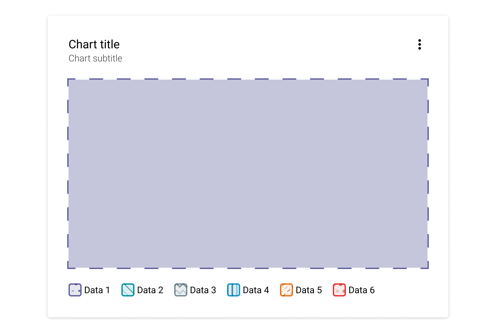
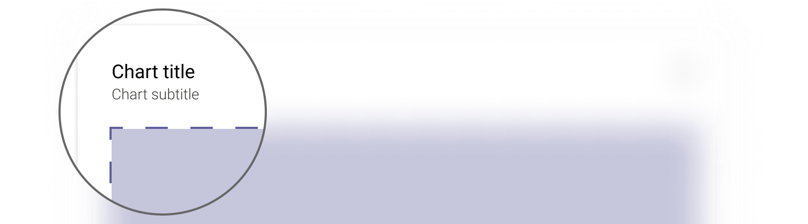
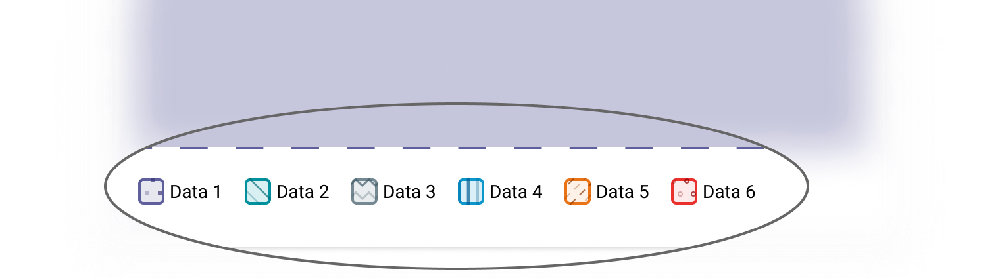

> The structure of the charts is designed with elements to ensure a good understanding of data representation. It maintains overall consistency between all of them.

## Content

### Title and Subtitle

Titles and subtitles should be descriptive and as short as possible to avoid display problems and improve readability.

 Use clear language and avoid acronyms.

### Legend

The chart doesn't need a legend if it shows only one category of data. However, the legend may appear if the chart title is not self-explanatory.

#### Default

Legends are positioned at the bottom of a chart by default.

#### Specific

Depending on the chart, layout and context, the legend can be positioned horizontally or vertically, bottom or right.

--Visual --
e.g. The donut legend can be displayed vertically at the bottom of the component due to its specific shape.

### Tooltip

Chart-specific tooltips are used to hover over data points, shapes, and axis values ​​on some charts to display more details about the data.

--Visual--

## Accessibility

We decided to use patterns and shapes to provide accessible and inclusive data visualization, especially for users with visual impairments.

<Highlight theme="warning" title="Keep in mind">
  Patterns are mandatory. Anyone who lands on a chart must be able to read it
  without turning on an accessibility option.
</Highlight>

## Do's & Dont's

<HintItem>Use only predefined colour combinations.</HintItem>

<HintItem>Always use a chart with its frame and provided features.</HintItem>

<HintItem dont>Don't modify the structure of a chart.</HintItem>

<HintItem dont>Don't replace patterns with solid colours.</HintItem>

<HintItem dont>
  Don't modify patterns to maintain consistency between products.
</HintItem>
