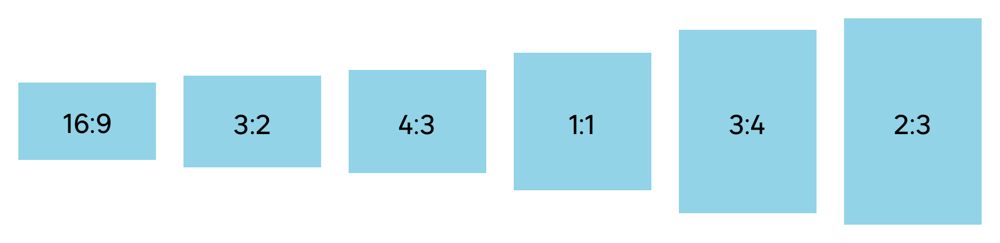

> The aspect ratio of an image is **the proportional relationship between its width and its height**. Aspect ratios are commonly written as a formula of width to height, like “16:9” or “4:3". The first value corresponds to the width, and the second to the height.  
> For example, an image with an aspect ratio of 1:1 is a square. So, the width and the height are identical, like 80px x 80px.

## Utility

Aspect ratios bring consistent image sizes across product and viewports. Using reference image formats in our user interface designs allow :

- Better anticipation of the image display. It is easier to predict which area of the image will be visible when cropping.
- Time saving for developers. It is no longer necessary for them to use specific values for each image.

## Recommended ratios

Here are the **6 recommended ratios** to build your components :

- 16:9
- 3:2
- 4:3
- 1:1
- 3:4
- 2:3

## Do's and don'ts

<HintItem>
    Maintain the proportional relationship between width and height when resizing.
</HintItem>

<HintItem dont>
    Don't use referenced aspect ratios for very specific use cases such as wide images (hero) or images outside the parent container.
</HintItem>
