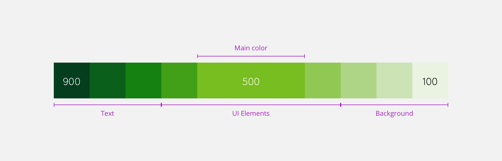

> Mozaic offers an adaptive and scalable color system. These colors have been defined using [HSLA](/Foundations/Colors/#anatomy) color swatches. The color palette has been divided in four categories: **Primary colors**, **Secondary colors**,**Greys** and **Status colors**.

<Highlight theme="warning" title="Be aware">

You will discover that colors are duplicated in some cases. This may seem strange to you, but we need to think about other brands and cultures to allow them to customize the colors.

For example, the success color may not be green in another country, and the primary brand color may not be usable for success with another brand.

**It is why you should take special care to use the right color variable for the right usage.**

</Highlight>

# Primary colors

Primary colors are the brand colors. They are the key components for our users to live and adopt LEROY MERLIN's experience. These are the two primary color palettes we use in this design system.

> Click on the variables to copy them.

## Primary 01

The primary green is the essence of the brand **LEROY MERLIN**.

<Swatch id="primary-01" />

## Primary 02

The primary blue is the essence of the sub-brand **LEROY MERLIN Campus**.
Campus is a brand of leroymerlin.fr dedicated to the inhabitant learning, it provides many tutorials and DIY resources online and in-store.

<Swatch id="primary-02" />

# Greys

We used the same principles to design our greyscale but greys are based on **11 values** swatches. Greys have specific use cases for **UI elements**:

- Texts & Titles
- Icons
- Backgrounds

<Swatch id="grey" />

# Status colors

Status colors convey various levels of importance for feedback information, like errors or warnings. They can also highlight important pieces of information or some tips. Status colors can also inform the user that an operation has failed or succeeded.

## Information

This color is used to highlight important pieces of information the user should be aware of.
Should only be used if the information does not represent a threat.

<Swatch id="info" />

## Success

Inform the user that an operation was successful.

<Swatch id="success" />

## Warnings

Inform the user about risks or threats. It teel the user to be careful about something.

<Swatch id="warning" />

## Danger

Inform the user of an error, or that some operation went wrong.

<Swatch id="danger" />

# Secondary colors

Secondary colors are essential to your design. We need them on many occasions to accentuate our primary colors and to deliver a specific message such as discounts and special offers. These guidelines may vary depending on the country you live in.

## Secondary Blue

Secondary Blue is mostly used for focus.
Use the [info]() swatch to highlight anything related to informational feedback for your users.

<Swatch id="secondary-blue" />

## Secondary Green

Secondary Green is for success. In LEROY MERLIN case, it is exactly the case as the primary-01. But other brands or BU should be able to change that.

<Swatch id="secondary-green" />

## Secondary Orange

Secondary Orange is used for user's feedback like the ratings.

<Swatch id="secondary-orange" />

## Secondary Red

Secondary Red is for discounts.

<Swatch id="secondary-red" />

## Secondary Yellow

Secondary Yellow is for illustrations and special offers.

<Swatch id="secondary-yellow" />

## Secondary Purple

Secondary Purple is used for illustration purposes.

<Swatch id="secondary-purple" />

# Anatomy

In this system, every color has a `dark` and a `light` variant that can be used to adapt to different usages from text to illustrations.

To have this flexibility, we designed color swatches based on **9 values** for primary and secondary colors. It means that you can use 9 values of the same color to fit your design needs.

> HSLA is a way to define colors based on three properties: **Hue**, **Saturation**, **Light**, and **Alpha**. We decided to use this standard to have more consistency between colors. It is also easier to relate colors to each other when they are based on HSLA.

This system allows the team to have every tint it needs to design every situation. It answers typography problems, illustration needs and it also allows us to contrast with deep background colors. Here is an example showing how it works based on our Primary-01 Secondary-Purple colors.

 

> The design needs to be accessible to everyone and these swatches when combined properly are compliant with color contrast rules for accessibility
