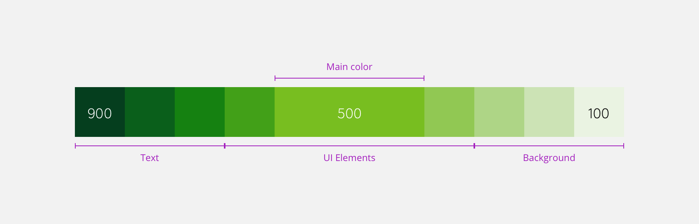

> Mozaic offers an adaptive and scalable colour system. The colour palette has been divided into four categories: **Primary colours**, **Secondary colours**, **Greys** and **Status colours**.

<Highlight type="warning" title="Be aware">

You will discover that colours are duplicated in some cases. This may seem strange to you, but we need to think about other brands and cultures to allow them to customize the colours.

For example, the success colour may not be green in another country, and the primary brand colour may not be usable for success with another brand.

**It is why you should take special care to use the right colour variable for the right usage.**

</Highlight>

# Primary colours

Primary colours are the brand colours. They are the key components for our users to live and adopt LEROY MERLIN's experience. These are the two primary colour palettes we use in this design system.

> Click on the variables to copy them.

## Primary 01

The primary green is the essence of the brand **LEROY MERLIN**.

<ColorPalette id="primary-01" />

## Primary 02 (beta colour to prepare the new version)

<ColorPalette id="primary-02" />

# Greys

We used the same principles to design our greyscale but greys are based on **11 values** swatches. Greys have specific use cases for **UI elements**:

- Texts & Titles
- Icons
- Backgrounds

<ColorPalette id="grey" />

# Status colours

Status colours convey various levels of importance for feedback information, like errors or warnings. They can also highlight important pieces of information or some tips. Status colours can also inform the user that an operation has failed or succeeded.

## Information

This colour is used to highlight important pieces of information the user should be aware of.
Should only be used if the information does not represent a threat.

<ColorPalette id="info" />

## Success

Informs the user that an operation was successful.

<ColorPalette id="success" />

## Warnings

Inform the user about risks or threats. It teels the user to be careful about something.

<ColorPalette id="warning" />

## Danger

This colour informs the user of an error or that some operation went wrong.

<ColorPalette id="danger" />

# Secondary colours

Secondary colours are essential to your design. We need them on many occasions to accentuate our primary colours and to deliver a specific message such as discounts and special offers. These guidelines may vary depending on the country you live in.

## Secondary Blue

Secondary Blue is mostly used for focus.
Use the [info]() swatch to highlight anything related to informational feedback for your users.

<ColorPalette id="secondary-blue" />

## Secondary Green

In LEROY MERLIN case, this colour is exactly the case as primary-01 but other brands or BU (business unit) should be able to change that.

<ColorPalette id="secondary-green" />

## Secondary Orange

Secondary Orange is used for user's feedback like the ratings.

<ColorPalette id="secondary-orange" />

## Secondary Red

Secondary Red is for discounts.

<ColorPalette id="secondary-red" />

## Secondary Yellow

Secondary Yellow is for illustrations and special offers.

<ColorPalette id="secondary-yellow" />

## Secondary Purple

Secondary Purple is used for illustration purposes.

<ColorPalette id="secondary-purple" />

# Anatomy

In this system, every colour has a `dark` and a `light` variant that can be used to adapt to different usages from text to illustrations.

To have this flexibility, we designed colour swatches based on **9 values** for primary and secondary colours. It means that you can use 9 values of the same colour to fit your design needs.

 

> The design needs to be accessible to everyone and these swatches when combined properly are compliant with colour contrast rules for accessibility
