>Icons must be **recognisable at first sight**. Here you will find how Leroy Merlin's icon kit has been made along with some design specificities to help you understand our vision.

## Categories
Icons library is divided in twelve categories :

- Navigation
- Product
- Service
- Project
- Media
- Social
- User
- Store
- Device
- Various
- Universe
- Logo

## Structure
### 1. Sizes
We have defined 5 sizes for our icons :
- 64px
- 48px
- 32px
- 24px
- 16px

In some very particular cases a 48px can be resized to 40px. 16px icons can only be used for navigation and rating stars.

### 2. Thickness
Leroy Merlin's icon are **outlined**. Thickness is very important in this style and must be followed. Every icon size has its guidelines in terms of thickness. Icon's thickness are divided in two categories : **major thickness** used to draw the outer shape of the icon and **minor thickness** to add a second level of details in the icon.

 

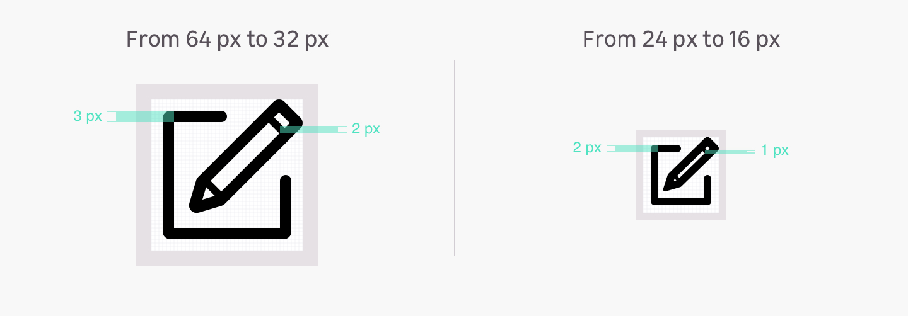

 

|Size       | Major thickness        | Minor thickness           | 
|-----------|------------------------|---------------------------|
| 64px      | 3px                    | 2px                       |
| 48px      | 3px                    | 2px                       |
| 32px      | 2px                    | 1px                       |
| 24px      | 2px                    | 1px                       |
| 16px      | 2px                    | 1px                       |

### 3. Radius
Radius is only applied to the outside of an outlined path. Rounded shapes don't respond to these following rules.

|Size       | Radius                 |
|-----------|------------------------|
| 64px      | 2px                    |
| 48px      | 2px                    |
| 32px      | 2px                    |
| 24px      | 1px                    |
| 16px      | 1px                    |

### 4. Angles

Angles must be 45° multiples.

Here are the possibilities :

- 45°
- 90°
- 135°
- 180°
- 225°
- 270°
- 315°
- 360°

### 5. Grids
The grid is a marker in the construction of the icon. It results in a consistent icon kit always using the same proportions. The grid allows the designer to design basic shapes on the same principles every time.

A **specific grid** has been designed for **each size**. The designed grids are :

- 64px
- 48px
- 32px
- 24px
- 16px

It's important to use the correct size when using an icon in your design. For example, you can't make 200% bigger a 24px icon to have a 48px icon.

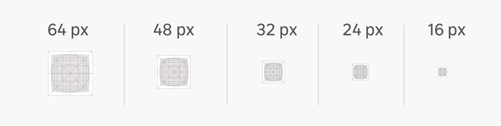

#### 5.1 Forms and shapes
The same paddings must be used around the main shape of the icon.
 

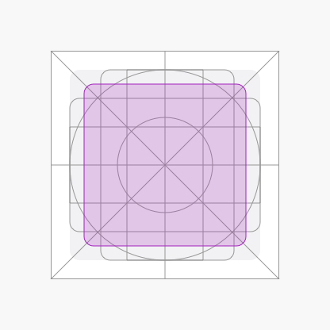

| Icon size      | Width         |Height         |
|----------------|---------------|---------------|
|64px            |46px           |46px           |
|48px            |34px           |34px           |
|32px            |22px           |22px           |
|24px            |16px           |16px           |
|16px            |10px           |10px           |

 
 
 

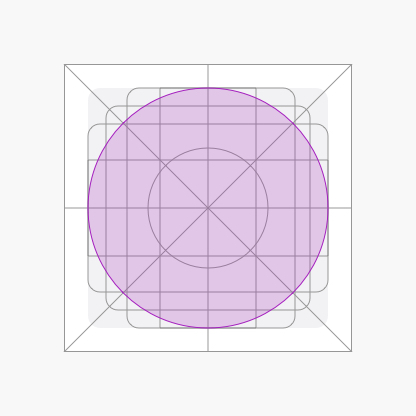

| Icon size      | Width         |Height         |
|----------------|---------------|---------------|
|64px            |54px           |54px           |
|48px            |40px           |40px           |
|32px            |26px           |26px           |
|24px            |20px           |20px           |
|16px            |12px           |12px           |

 
 
 

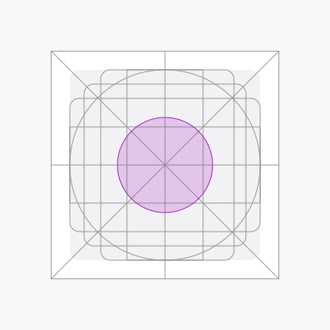

| Icon size      | Width         |Height         |
|----------------|---------------|---------------|
|64px            |27px           |27px           |
|48px            |20px           |20px           |
|32px            |14px           |14px           |
|24px            |10px           |10px           |
|16px            |07px           |07px           |

 
 
 

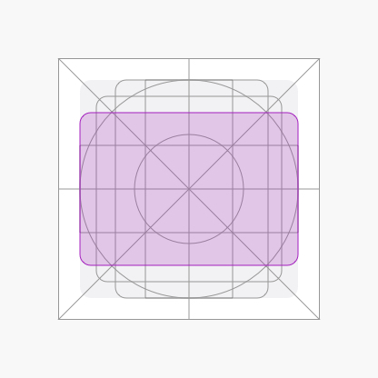

| Icon size      | Width         |Height         |
|----------------|---------------|---------------|
|64px            |54px           |38px           |
|48px            |40px           |28px           |
|32px            |26px           |18px           |
|24px            |20px           |12px           |
|16px            |12px           |8px            |

 
 
 

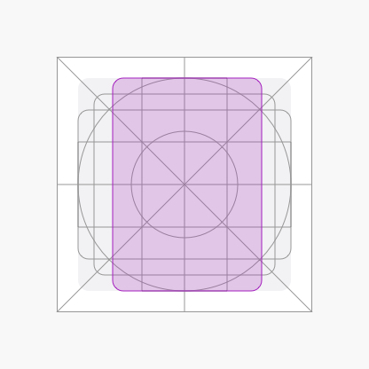

| Icon size      | Width         |Height         |
|----------------|---------------|---------------|
|64px            |38px           |54px           |
|48px            |28px           |40px           |
|32px            |18px           |26px           |
|24px            |12px           |20px           |
|16px            |8px            |12px           |

 
 
 

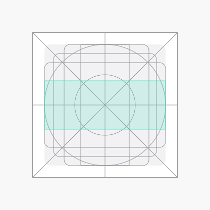

| Icon size      | Width         |Height         |
|----------------|---------------|---------------|
|64px            |54px           |22px           |
|48px            |40px           |16px           |
|32px            |26px           |10px           |
|24px            |20px           |8px            |
|16px            |12px           |6px            |

 
 
 

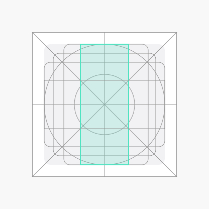

| Icon size      | Width         |Height         |
|----------------|---------------|---------------|
|64px            |22px           |54px           |
|48px            |16px           |40px           |
|32px            |10px           |26px           |
|24px            |8px            |20px           |
|16px            |6px            |12px           |

### Spacings

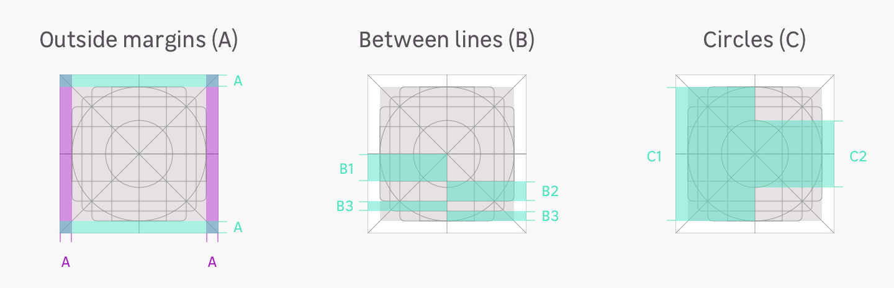

|         |A      |B1      |B2      |B3      |
|---------|-------|--------|--------|--------|
|*64px*   |5px    |11px    |8px     |4px     |
|*48px*   |4px    |8px     |6px     |3px     |
|*32px*   |3px    |5px     |4px     |2px     |
|*24px*   |2px    |4px     |2px     |2px     |
|*16px*   |2px    |3px     |1px     |1px     |

## Best practices

**Fixed size vs. variable size**

<hint type="do">
  <hintitem do="true">
    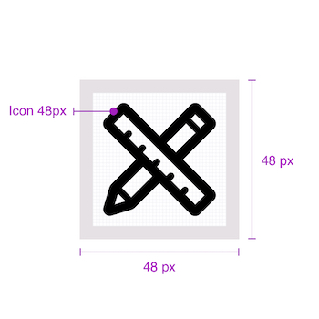
     
    An icon must be used in its original size.
  </hintitem>
</hint>
<hint type="dont">
  <hintitem dont="true">
    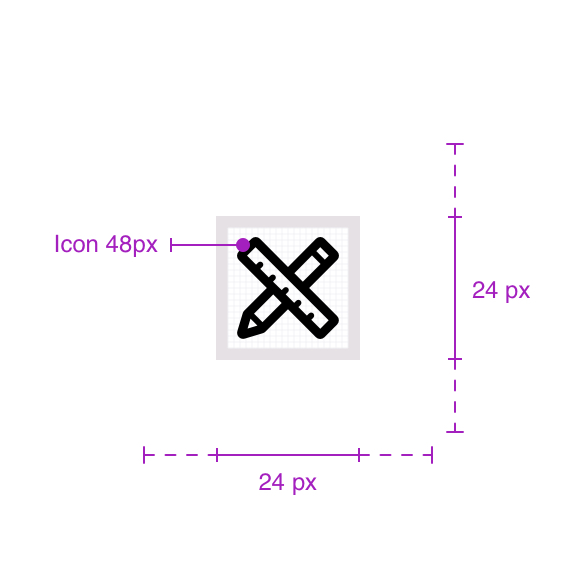
     
    An icon can't be used in another size.
  </hintitem>
</hint>

**Geometry vs. organic**

<hint type="do">
  <hintitem do="true">
    
     
    An icon is based on geometric shapes.
  </hintitem>
</hint>
<hint type="dont">
  <hintitem dont="true">
    
     
    An icon is not supposed to represent reality.
  </hintitem>
</hint>

**Simple icon vs. complex icon**

<hint type="do">
  <hintitem do="true">
    
     
    An icon must be as simple as possible.
  </hintitem>
</hint>
<hint type="dont">
  <hintitem dont="true">
    
     
    An icon shouldn't carry too many details.
  </hintitem>
</hint>

**Outlined icon vs. filled icon**

<hint type="do">
  <hintitem do="true">
    
     
    An icon must be as simple as possible.
  </hintitem>
</hint>
<hint type="dont">
  <hintitem dont="true">
    
     
    An icon in Leroy Merlin's design can't be filled.
  </hintitem>
</hint>

**Opacity**

<hint type="do">
  <hintitem do="true">
    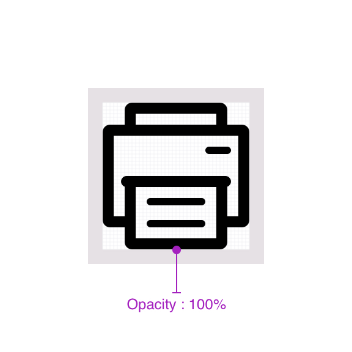
     
    An icon uses 100% opacity colors.
  </hintitem>
</hint>
<hint type="dont">
  <hintitem dont="true">
    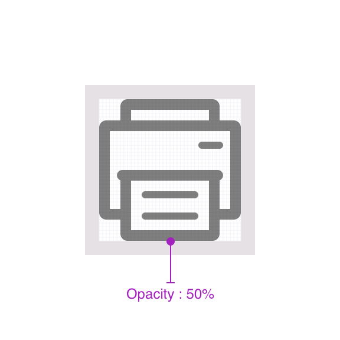
     
    An icon can't use an opacity under 100%.
  </hintitem>
</hint>

**Single icon vs. drawn over**

<hint type="do">
  <hintitem do="true">
    
     
    An icon is unique.
  </hintitem>
</hint>
<hint type="dont">
  <hintitem dont="true">
    
     
    An icon can't be used with another element on top.
  </hintitem>
</hint>
