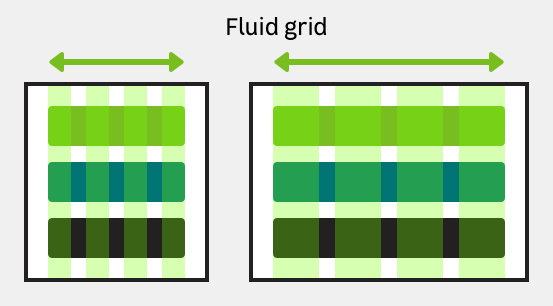
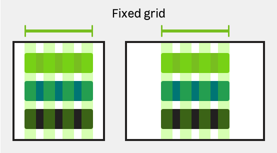
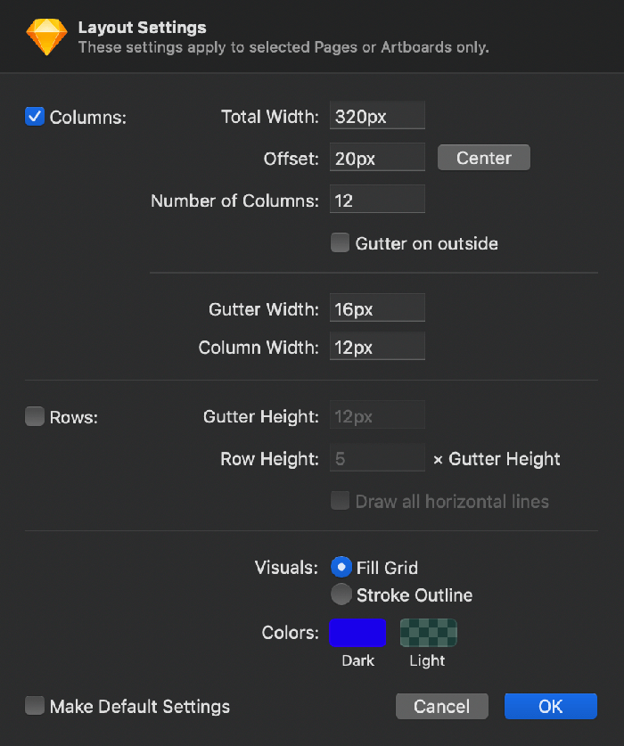
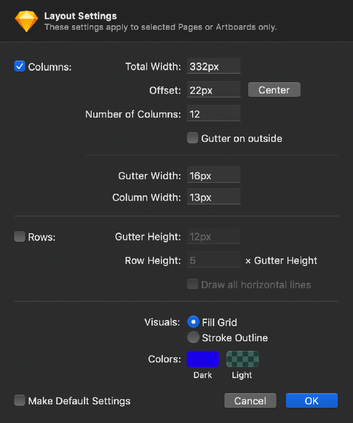

> These are the recommendations to set up the values to use as your layout settings in your Sketch files.

## Layout behaviors

Grids on breakpoints from `S` to `M` are fluid.

From `L` to `XXL` breakpoints you can use fixed or fluid grids to fit your needs.

fixed-grid

## Sketch configuration

### Breakpoint `S`

#### 320px (Fluid)

#### 360px (Fluid)

#### 375px (Fluid)

### Breakpoint `M`

#### 680px (Fluid)

#### 768px (Fluid)

### Breakpoint `L`

#### 1024px (Fixed & Fluid)

### Breakpoint `XL`

#### 1280px (Fixed & Fluid)

#### 1366px (Fixed)

#### 1366px (Fluid)

#### 1440px (Fixed)

#### 1366px (Fluid)

### Breakpoint `XXL`

#### 1920px (Fixed & Fluid)

