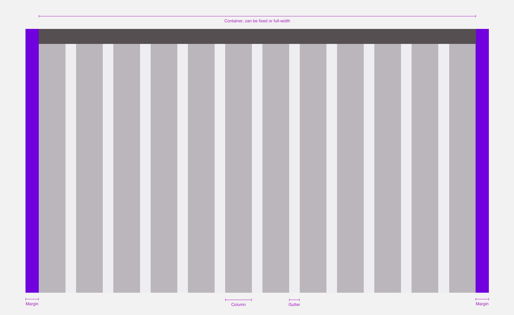
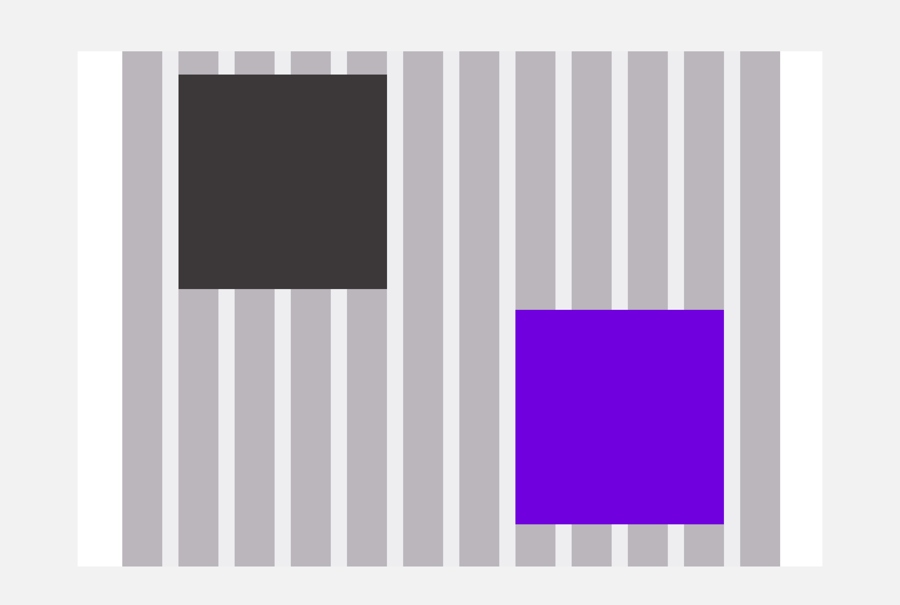

> A grid is used to create a structured and harmonious design for every breakpoints. It is the frame of your page that allows you to build your layout by placing blocks of contents (texts, images, etc.) using a certain number of columns.

## Grids anatomy

- **Columns**: It allows us to place and structure the content.
- **Gutters**: It's the space between the columns, it gives the design some air and helps to split the content.
- **Margins**: It's the space between the edge of the screen and the container.
- **Container**: The container defines the main content width as well as the minimum negative space between the horizontal edges of the screen and the content.

Those properties can change depending on the breakpoint.

# Principles

When using a grid, you decide the size of your elements by **the number of columns they use.**

<HintItem>
  An element should always stand on one or between several columns.
</HintItem>
<HintItem>
  Elements are always separated by either a gutter or a combination of columns.
  and gutter
</HintItem>
<HintItem dont>An element should never start on a gutter.</HintItem>
 

# LEROY MERLIN's default grid

We work with **12-columns grids** because the number twelve is the most versatile. Twelve is divisible among reasonably small numbers; it’s possible to have 12, 6, 4, 3, 2 or 1 evenly spaced columns. This gives designers a lot of flexibility when they create a layout.

<HintItem>
  Gutters and margins widths should always be multiples of the Magic Unit.
</HintItem>
 

| Breakpoint            | Container width | Columns | Columns width            | Gutters width | Margins (on each side) |
| --------------------- | --------------- | ------- | ------------------------ | ------------- | ---------------------- |
| `s` (320px and up)    | Fluid           | 12      | Fluid                    | `1mu` 16px    | `1mu` (16px)           |
| `m` (680px and up)    | Fluid           | 12      | Fluid                    | `2mu` 32px    | `2mu` (32px)           |
| `l` (1024px and up)   | 928px / Fluid   | 12      | `3mu` (48px) / Fluid     | `2mu` 32px    | `3mu` (48px)           |
| `xl` (1280px and up)  | 1216px / Fluid  | 12      | `4.5mu` (72px) / Fluid   | `2mu` 32px    | `2mu` (32px)           |
| `xxl` (1920px and up) | 1840px / Fluid  | 12      | `7.75mu` (124px) / Fluid | `2mu` 32px    | `2.5mu` (40px)         |

 
<small>Reminder : mu = MagicUnit. Ex: 3.5mu = MagicUnit \* 3.5</small>

## Default container

The default grid uses [the default container](/foundations/layout/container/).

 
