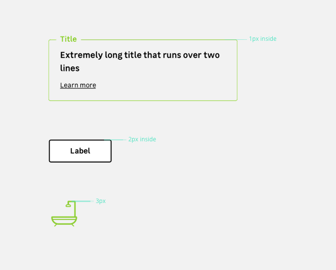

> Strokes are visual elements that space and structure contents. Different border thickness are used to create a hierarchy.

## Preview

Strokes can be applied to different components like :

- Icon lines,
- Button and notification outlines,
- Dividers,
- etc

## Variations

There are **three different thickness levels** :

- `Small` : 1px (0.0625mu)
- `Large` : 2px (0.125mu)
- `Medium` : 3px (0.1875mu)
