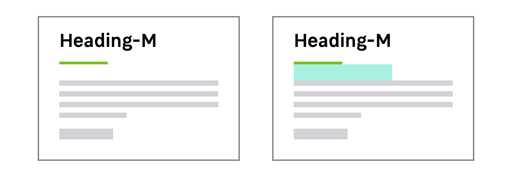

> The heading pattern provides basic typographic styles for your page titles, also known as H1. Each heading has its own sizes depending on the breakpoints.

<Highlight theme="tips" title="Heading styles">

  There are two different types of heading styles for Mozaic. One is a text only
  and the other style is a combination of a text and an underline. [Read
  more](/Foundations/Typography/HeadingStyles/#underline-colors).

</Highlight>

<Preview path="typographyHeading-base" nude />

## Recommended sizes

### Heading Medium

Heading medium are supposed to be used as the default heading style for your pages. Every breakpoint has a default value that should be used in most cases.

|  Breakpoint                 |  Heading size   |
| --------------------------- | --------------- |
| `S` (320px and up)          | 28px (1.75mu)   |
| `M` (680px and up)          | 34px (2.125mu)  |
| `L` to `XL` (1024px and up) | 41px (2.5625mu) |

<Preview path="typographyHeadingMedium" nude />

<HintItem dont>
  Don't use a larger size for your text elements than the heading size in your pages. This will help you maintain a consistent hierarchy.
</HintItem>

## Specific needs

This heading styles system still allows you to answer specific needs depending on the content of your pages or your section.

### Heading Small

These heading styles sizes are the smallest sizes you can use for your titles.

|  Breakpoint                 |  Heading size  |
| --------------------------- | -------------- |
| `S` (320px and up)          | 23px (1.75mu)  |
| `M` (680px and up)          | 28px (1.75mu)  |
| `L` to `XL` (1024px and up) | 34px (2.125mu) |

<Preview path="typographyHeadingSmall" nude />
<Highlight theme="warning" title="Be aware">
  If you use smaller values you will loose visual hierarchy with the body.
</Highlight>

### Heading Large

Mozaic provides large heading styles when you need to make some titles stand out. You can find these cases on landing pages for example.

|  Breakpoint                 |  Heading size   |
| --------------------------- | --------------- |
| `S` (320px and up)          | 34px (2.125mu)  |
| `M` (680px and up)          | 41px (2.5625mu) |
| `L` to `XL` (1024px and up) | 49px (3.0625mu) |

<Preview path="typographyHeadingLarge" nude />

## Variations

### Font weight

There are two different font-weights available for your text headings.

| Font-weight | Usage                                                                |
| ----------- | -------------------------------------------------------------------- |
| Regular     | Use this font-weight for your common text headings                   |
| SemiBold    | This font-weight allows you to visually emphasise your text headings |

### Text colors

You can use the darkest or the lightest font color depending on the background color. This choice must be made with accessibility in mind.

<Preview path="typographyHeading-colors" nude />

### Underlined headings

In some cases, your title can be a combination of a text and an underline. These underlined headings can be useful when you need to give more importance to your heading or make visual separations.

<Highlight theme="warning">

  Please note that underlined headings are available in **SemiBold only**.

</Highlight>

#### Underline colors

The color of the underline allows you to give visual context to your page or section.

| Color theme    | Usage                                                      |
| -------------- | ---------------------------------------------------------- |
| Primary-01-500 | For LEROY MERLIN title pages on light and dark backgrounds |
| Primary-01-200 | For LEROY MERLIN title pages on Primary-01-500 backgrounds |
| Primary-02-600 | For LEROY MERLIN Campus title pages on light backgrounds   |
| Primary-02-200 | For LEROY MERLIN Campus title pages on dark backgrounds    |

<Preview path="typographyHeading-underlines" nude />

#### Bottom padding

Headings provide with a default bottom padding to keep a right rythm between the other elements of the interface.

### Alignment

You can find different aligments, `left` / `center`/ `right` for your headings.

<Highlight theme="tips">
  The heading underline will move depending on the alignment you choose to use.
</Highlight>
