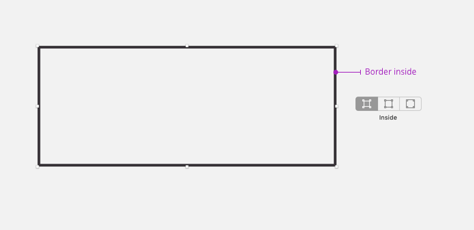

##Anatomy

## How to use

<HintItem>
    Always set borders <b>inside</b>
</HintItem>
<HintItem>
    Always set <b>squared ends</b> for open shapes
</HintItem>
<HintItem>
    Always set <b>squared joins</b> for open shapes
</HintItem>
