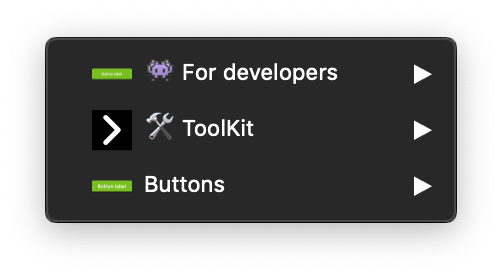

> Mozaic is a product used by a lot of people. When so many people work together from different places on such a big project, you need to establish some ground rules that everyone needs to follow. Designers of Mozaic follow some rules across every tool to create consistency and simplify the collaboration process.

## English for everyone

Every file, layer, symbol and so on are named in english.

## File Naming Conventions

The prefix always contains two letters depends on the type of pattern as you can see below: **_[XX]FileName_**

| Prefix   | Pattern type        | Description                                                                                           |
| -------- | ------------------- | ----------------------------------------------------------------------------------------------------- |
| **[AA]** | Styles              | The styles correspond to Mozaic's foundations (Colors, icons, fonts, shadows, ...)                    |
| **[BA]** | Simple Components   | The simple components are build from the styles (Buttons, links, tags, forms, ...)                    |
| **[BB]** | Complex Components  | The complex components are depending on simple components or group together several simple components |
| **[ZZ]** | Specific librairies | Tools, documentation, ...                                                                             |

## Symbols categorization

We use this categorisation to create consistency in our libraries :

| Categrory             | Usage                                                                                                                                                    |
| --------------------- | -------------------------------------------------------------------------------------------------------------------------------------------------------- |
| **👾 For developers** | These symbols should not be used in your designs. They are meant to share the different states of a component with developers.                           |
| **🛠 ToolKit**         | This section contains the symbols used to build the final symbols. They are not meant to be used directly but to be accessible through symbol overrides. |
| **Component Name**    | This is where you'll find the ready to use symbols of the library.                                                                                       |

## Components naming

We use **PascalCase** for the naming of our symbols and our artboards. Pascal case combines words by capitalizing all words, even the first word and removing the space. For example, `user login count` in raw text becomes `UserLoginCount` in PascalCase.

### Specific Naming

We use a double hyphen as suffixes to indicate a specific information.
For example: _Button / 01-Solid / 01-S / 01-Primary_`--Campus`
